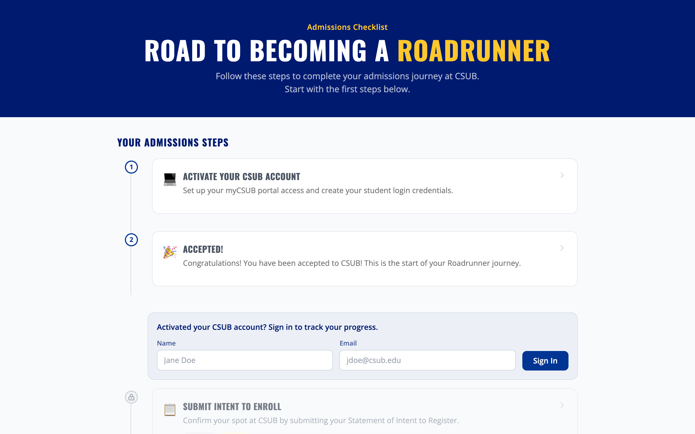
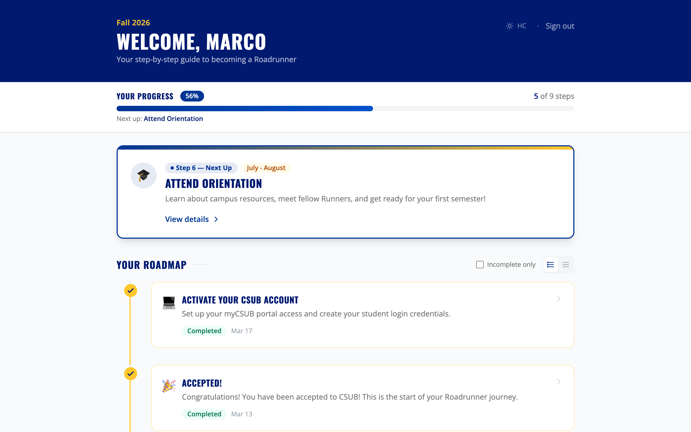

# CSUB Runner Roadmap V2 — Road to Becoming a Roadrunner

An interactive student onboarding application for California State University, Bakersfield. Guides newly admitted students through every step of the admissions process — from acceptance to their first day of classes.

This is a rewrite of the original React + Node/Express + PostgreSQL app onto a **Vue 3 + C# (ASP.NET Core) + SQL Server** stack, keeping the same functionality with deliberately simple, low-abstraction, readable code. The original lives in the sibling `CSUB-admissions/` folder and was the reference for behavior parity.


---

## Screenshots

### Public Landing Page


### Student Dashboard


### Admin Dashboard


---

## Features

- **Interactive admissions roadmap** with personalized step tracking and deadline awareness
- **Admin dashboard** for managing students, steps, analytics, audit logs, terms, and users
- **Integration API** for external systems (SIS, ERP) with inbound push and outbound polling ("API checks")
- **Tag-based step filtering** to show relevant steps per student profile
- **Role-based access control** — viewer, admissions, admissions_editor, sysadmin
- **Multi-term support** for managing separate cohorts (Fall 2026, Spring 2027, etc.)
- **Accessible and responsive** — high-contrast mode, keyboard navigation, mobile-friendly

---

## Tech Stack

- **Frontend:** Vue 3 + Vite + Tailwind + Pinia. Tiptap (rich text), vue-chartjs (analytics), vuedraggable (reorder), MSAL (Azure AD SSO). Served by a non-root nginx in production. Unit-tested with Vitest; linted with ESLint + Prettier.
- **Backend:** ASP.NET Core (.NET 10) controllers + Dapper (hand-written T-SQL). No ORM. Built with .NET analyzers and warnings-as-errors; transient-fault retry on all SQL; liveness/readiness health probes.
- **Database:** SQL Server 2022. Schema is applied idempotently on startup and tracked in a `schema_version` table. **In production a DBA provisions the database and a least-privilege login — the app does not run `CREATE DATABASE`.** Database creation and seeding auto-run only outside Production (see [Deployment](docs/DEPLOYMENT.md)).

See [docs/LIBRARIES.md](docs/LIBRARIES.md) for every dependency, what it does, and a link to its docs.

---

## Quick Start

The fastest way to see the whole app is the three-container Docker stack. The `api` container runs in Production and refuses weak/missing secrets, so set them first:

```bash
cp .env.example .env        # then set JWT_SECRET, ADMIN_DEFAULT_PASSWORD, API_CHECK_ENCRYPTION_KEY, MSSQL_SA_PASSWORD
docker compose up --build   # -> http://localhost:3000
```

Default admin login: `admin@csub.edu` with the `ADMIN_DEFAULT_PASSWORD` you set in `.env` — the containerized api runs as Production and **rejects** weak/default passwords like `admin123` (that default applies only to local `dotnet run` development).

See the [Development Setup Guide](docs/SETUP.md) for local (non-container) development and for running the frontend on its own (e.g. a Windows desktop).

---

## Documentation

| Document | Description |
|----------|-------------|
| [Development Setup](docs/SETUP.md) | Prerequisites, running locally, running the frontend on Windows, environment variables, default credentials, lint/test/format commands |
| [Architecture](docs/ARCHITECTURE.md) | Tech stack, project structure, request/data flow, startup sequence, resilience (retry + health probes), three-container deployment |
| [Deployment](docs/DEPLOYMENT.md) | **Production deployment to a Windows Server + SQL Server**: the connection-string model, least-privilege DBA-provisioned login, `Encrypt=True`, Windows/Integrated auth, the `Database:AutoCreate`/`Database:Seed` flags, container hardening, health probes, TLS, and a go-live checklist |
| [Authentication](docs/AUTH-ROADMAP.md) | Student/admin/integration auth, JWT, RBAC, Azure AD SSO, the roadmap personalization logic, production checklist |
| [API Integration](docs/API-GUIDE.md) | REST API reference for external system integration (inbound push + outbound API checks) + health endpoints |
| [Libraries](docs/LIBRARIES.md) | Every backend/frontend/infra dependency, what it does, and a link to its docs |
| [Testing](docs/TESTING.md) | Running the xUnit integration suite + the Vitest frontend suite, the CI pipeline, test strategy, adding new tests |
| [Development with Claude Code](docs/CLAUDE-CODE.md) | Using Claude Code for feature development |
| [Enterprise Readiness](ENTERPRISE-READINESS.md) · [Parity Audit](AUDIT.md) · [Security Audit](SECURITY-AUDIT.md) | Enterprise gap analysis + resolutions, the conversion parity audit, and security/code audit findings |

---

## Deployment

> **Production deployment** (app in containers, SQL Server on a Windows Server) is documented step-by-step in **[docs/DEPLOYMENT.md](docs/DEPLOYMENT.md)** — including the DBA-provisioned least-privilege login, `Encrypt=True`, Windows/Integrated auth, TLS, and a go-live checklist. The compose stack below is for local/testing.

Three containers, defined in [`docker-compose.yml`](docker-compose.yml):

| Container | What it is | Published |
|-----------|-----------|-----------|
| **web** | Vue build served by a **non-root** nginx (uid 101, listens on 8080), reverse-proxying `/api` to the API (same-origin, no CORS) — built from `client/Dockerfile` | host `3000` → container `8080` |
| **api** | ASP.NET Core API only, runs as a non-root user — built from `Api/Dockerfile` | `127.0.0.1:8080` (debug only) |
| **sqlserver** | SQL Server 2022 (local/testing only — prod uses a real SQL Server) | `127.0.0.1:1433` |

Both app containers declare a Docker `HEALTHCHECK` (api: `/api/health/live`, web: the SPA shell), and compose gates `web` startup on the `api` being healthy.

```bash
cp .env.example .env
docker compose up --build         # full stack on http://localhost:3000
```

Each piece can also be launched on its own:

```bash
docker compose up -d sqlserver    # just the database
docker compose up -d --build api  # database + API (depends_on starts sqlserver)
docker compose up -d --build web  # full stack (depends_on pulls in api + sqlserver)
```

> On Apple Silicon, SQL Server runs as a linux/amd64 container — enable Rancher/Docker Desktop's
> **VZ backend with Rosetta** (`rdctl set --virtual-machine.use-rosetta=true`).

---

## Configuration

`Api/appsettings.Development.json` holds local dev settings. In production / containers, set these via `.env` or environment variables (double-underscore syntax):

| Variable | Required | Purpose |
|----------|----------|---------|
| `ConnectionStrings__Default` | Yes | SQL Server connection string. Drives **everything** about DB connectivity — SQL login or Windows/Integrated auth, container or bare metal, `Encrypt=True` for prod. See [Deployment](docs/DEPLOYMENT.md) |
| `Jwt__Secret` | Yes | HS256 signing secret (≥ 32 chars); the API rejects weak/missing values in Production |
| `Admin__DefaultEmail` / `Admin__DefaultPassword` | Yes (password) | Seeded default admin; the seeder rejects weak/default passwords in Production |
| `ApiCheck__EncryptionKey` | Yes | 64-hex (32-byte) key to encrypt stored API-check credentials |
| `Database__AutoCreate` | No | Whether the app runs `CREATE DATABASE` if the DB is missing. **Defaults to `false` in Production** (a DBA provisions it), `true` otherwise. Set explicitly to override |
| `Database__Seed` | No | Whether to seed bootstrap data (default term, checklist, admin, integration client) on an empty DB. Defaults to `true`; set `false` if a DBA seeds out-of-band |
| `LocalLogin__Username` / `LocalLogin__Password` | No | Break-glass local admin login (disabled unless both are set) |
| `AzureAd__ClientId` / `AzureAd__TenantId` | No | Azure AD SSO (omit to disable; endpoints return 501) |
| `Integration__DefaultName` / `Integration__DefaultKey` | No | Seeded integration client |
| `Cors__Origin` | No | Allowed CORS origin (only if the client is served from a different origin) |

Client config is **inlined by Vite at build time** (not runtime), so it is passed as Docker build args: `VITE_AZURE_AD_CLIENT_ID`, `VITE_AZURE_AD_TENANT_ID`, `VITE_AZURE_AD_REDIRECT_URI`, and `VITE_ALLOW_DEV_LOGIN` (keep `false` for real deployments). See [Deployment](docs/DEPLOYMENT.md) and `.env.example`.

---

## Layout

```
Api/         ASP.NET Core API (Controllers, Data, Auth, Services, Models, Serialization) + Dockerfile
client/      Vue 3 client (pages, components, stores, composables) + Dockerfile + nginx config
tests/       xUnit integration tests (Api.IntegrationTests)
docs/        documentation + screenshots
docker-compose.yml   web + api + sqlserver
.env.example         template for the secrets the api container requires
AUDIT.md             parity audit of the conversion vs. the original app
SECURITY-AUDIT.md    security/code audit findings and resolutions
```

---

## License

This project was built for CSUB Admissions. All rights reserved.
