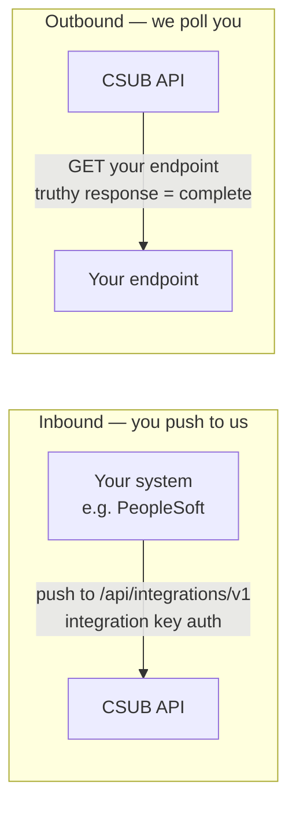
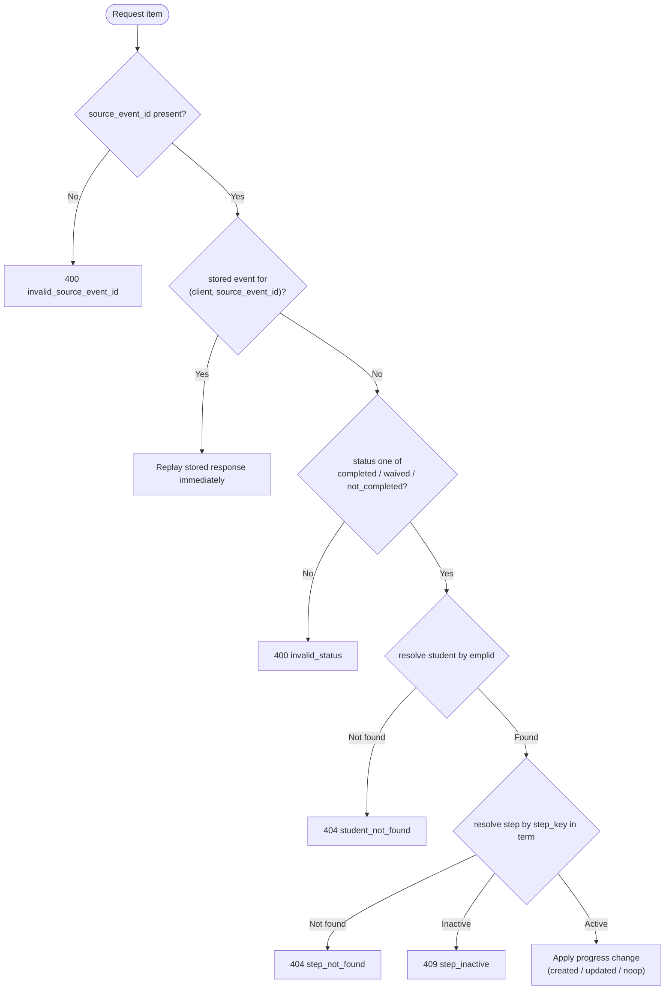
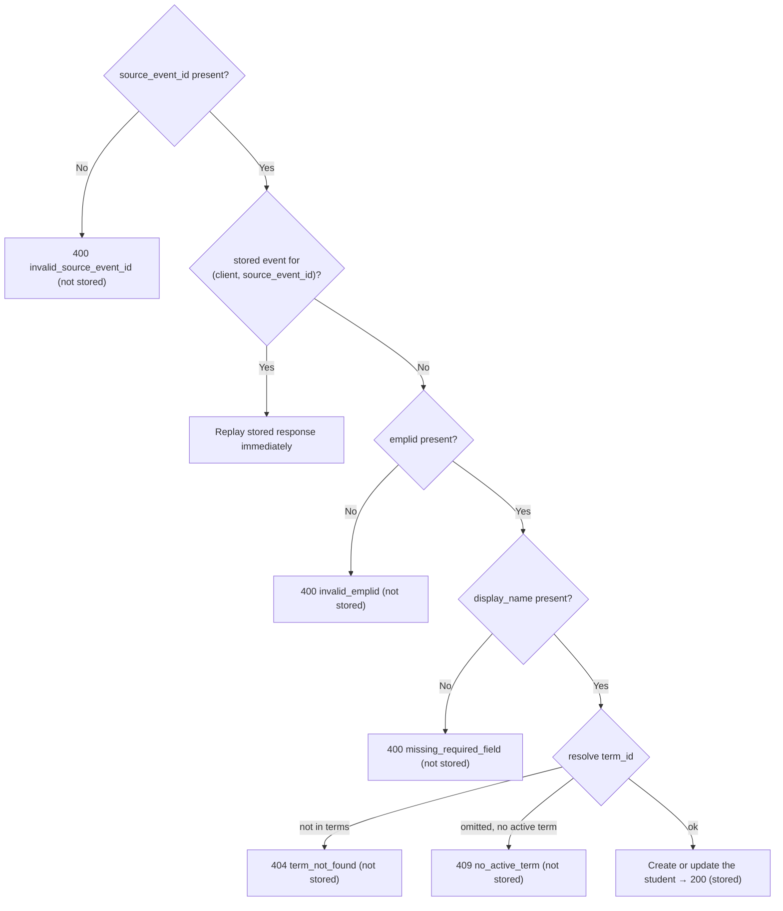
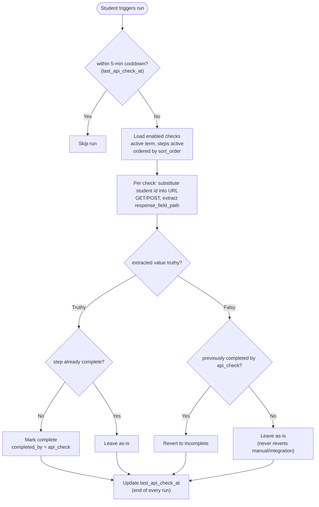
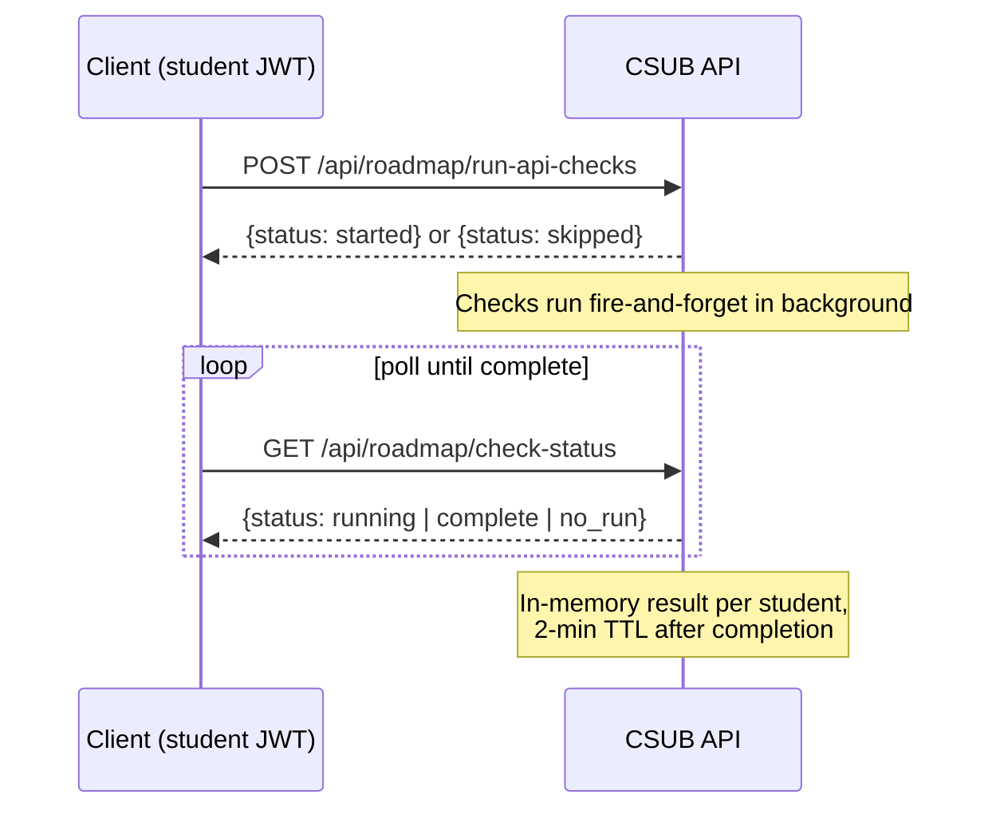

# CSUB Admissions API Integration Guide

This guide covers how external systems integrate with the CSUB Admissions app. There are two integration patterns:

| | Inbound (Push) | Outbound (Poll) |
|---|---|---|
| **Direction** | External system calls *our* API | Our app calls *your* API |
| **Use case** | PeopleSoft marks a step complete after processing | App checks if a student submitted a form on an external portal |
| **Who initiates** | Your system | Our app (triggered by the student) |
| **Auth method** | Integration key | Configured per-step by a sysadmin (none, basic, or bearer) |



The app is an **ASP.NET Core (.NET 10)** service using **Dapper** + hand-written T-SQL against **SQL Server**, paired with a **Vue 3 (Vite)** single-page app. The endpoints below — paths, payloads, status codes, JSON key names — are a **stable contract**: integration partners can rely on these shapes not changing between releases. Where a behavior is enforced by a specific source file, that file is named so you can verify it.

**Base URL:** `https://your-domain.com` (substitute your production hostname)

### Where the API lives

Call the app at its public origin — `https://your-host/api/...`. In production the SPA and API are **same-origin behind nginx**, so **CORS is not involved**: your client just needs the base URL above plus an integration key. For the container topology see [ARCHITECTURE.md](ARCHITECTURE.md); for local-dev ports see [SETUP.md](SETUP.md).

### TL;DR — pick your path

| You are… | Read |
|---|---|
| **Pushing completions in** | [Authentication](#authentication--security) (integration key) + [Inbound Integration](#inbound-integration-push-data-in) |
| **Building an endpoint we poll** | [Outbound Integration](#outbound-integration-poll-external-apis) + [What Your External Endpoint Must Provide](#what-your-external-endpoint-must-provide) |
| **Operating the server** | [Configuration](#configuration) |

Three must-knows for inbound callers: always send a **`source_event_id`** (idempotency); the **batch endpoint always returns 200** — check each item's `success`; **snake_case field names are a frozen contract**.

---

## Table of Contents

1. [Authentication & Security](#authentication--security)
2. [Inbound Integration (Push Data In)](#inbound-integration-push-data-in)
3. [Outbound Integration (Poll External APIs)](#outbound-integration-poll-external-apis)
4. [Health & monitoring endpoints](#health--monitoring-endpoints)
5. [Configuration](#configuration)
6. [Running the app](#running-the-app)
7. [Error Code Reference](#error-code-reference)

---

## Authentication & Security

The app uses three separate authentication models depending on the audience.

### Integration Key (for inbound API)

Integration clients are provisioned with a secret key. The raw key is never stored — only a **bcrypt hash** is kept in the database (`integration_clients.key_hash`). The gate that enforces this is `Api/Auth/IntegrationAuthAttribute.cs`, applied as `[IntegrationAuth]` to the whole `IntegrationsController`.

Send your key in one of two ways:

```
X-Integration-Key: your-secret-key
```

or

```
Authorization: Bearer your-secret-key
```

`X-Integration-Key` is checked first; if it is empty, the `Authorization: Bearer` value is used. Either way the value is trimmed before comparison.

**How the gate validates your key:** the raw key you send is bcrypt-compared (`Passwords.Verify`) against the stored `key_hash` of active clients. There are two lookup paths:

- **Recommended for production —** send an `X-Client-Name` header naming your client. The app looks up that **single** active client by name and bcrypt-compares against just its hash. This is fast and avoids a bcrypt computation per active client.
- **Fallback —** if you do not send `X-Client-Name`, the app scans up to the **first 10 active clients** (`SELECT TOP 10 ... WHERE is_active = 1`) and bcrypt-compares each. This is kept for backward compatibility and bounded at 10 to prevent a bcrypt-amplification DoS.

On success, the gate stashes the client's name and id on the request (`HttpContext.Items["integrationClientName"]` / `["integrationClientId"]`). The name becomes the audit-log actor (`source_system`) for any completion the request records, and the id scopes idempotency.

**Key provisioning:** A default client is seeded on startup from the `Integration__DefaultName` / `Integration__DefaultKey` configuration values (see [Configuration](#configuration)). In **local development**, if no key is configured, a client named `PeopleSoft Dev` is seeded with the key `dev-integration-key`. In **production**, no client is auto-seeded unless `Integration__DefaultKey` is set. You can also add clients by inserting directly into the `integration_clients` table — each row has a `name`, `key_hash`, and `is_active` flag.

**Rotating keys:** Create a new integration client, update your systems to use the new key, then deactivate the old client by setting `is_active = 0`. Because the gate only considers `is_active = 1` rows, the old key stops working the moment you flip the flag.

### Admin JWT (for API check configuration)

Admin endpoints require a JWT obtained from `POST /api/admin/auth/login`. The token is sent as:

```
Authorization: Bearer <admin-jwt>
```

Admin roles control access:

| Role | Access |
|------|--------|
| `viewer` | Read-only access to admin dashboards |
| `admissions` | Can mark steps complete/incomplete for students |
| `admissions_editor` | Can create/edit steps and terms |
| `sysadmin` | Full access including API check configuration and user management |

The API-check configuration endpoints in this guide are gated to **`sysadmin`** specifically (`[AdminAuth("sysadmin")]` on `Api/Controllers/Admin/ApiChecksController.cs`).

> **Note:** There is no API-key path for *admin* endpoints — admin access is JWT-only. (Integration keys only authenticate the `/api/integrations/*` surface.)

### Rate Limiting

All `/api/` routes are rate-limited to **200 requests per 15 minutes** per IP address, configured in `Api/Program.cs` using ASP.NET Core's built-in `RateLimiter`. Requests over the limit receive HTTP **429**.

- The limiter is **scoped to paths starting with `/api`**, so SPA/static-asset requests do not consume your API budget.
- Auth endpoints opt into stricter named policies: **login** is `10 / 15 min` per IP and the break-glass **local login** is `5 / 15 min` per IP.
- The whole limiter can be disabled with `RateLimiting__Disabled=true` (used by the xUnit integration test suite so the per-IP login limit doesn't trip during a run). Do not set this in production.

> Rate-limited requests are rejected with a bare **429** — no `RateLimit-*` advisory headers are sent, so treat any 429 as "back off and retry later."

### Credential Encryption

Outbound API-check credentials (basic-auth passwords, bearer tokens) are encrypted at rest using **AES-256-GCM** (`Api/Services/Encryption.cs`). The on-disk format is a JSON string `{ "iv": ..., "data": ..., "tag": ... }` where each field is **hex-encoded** — a **12-byte IV** and a **16-byte GCM authentication tag**. The encryption key is read once at startup from `ApiCheck__EncryptionKey` and must be a **64-character (32-byte) hex string**; anything else — a malformed/wrong-length value, **or a 64-hex key made of a single repeated character** (e.g. all zeros, rejected as a weak/placeholder key by `Encryption.IsWeakKey`) — leaves encryption "not configured" and any attempt to save credentials returns `500 Encryption key not configured on server`.

### SSRF Protection

Outbound API-check URLs are validated before any request is made (`ApiCheckRunner.ValidateUrlAsync` in `Api/Services/ApiCheckRunner.cs`). SSRF validation is **always active and fail-closed** — it is **not** gated by environment. In **every** environment the following are blocked:

- Non-HTTP(S) schemes (only `http:` and `https:` are allowed)
- `localhost` (and `::1` / `[::1]`)
- Private IPv4 ranges: `10.x`, `172.16–31.x`, `192.168.x`, `127.x`, `169.254.x`, and `0.x`
- Private IPv6: `::1`, and addresses with `fc` / `fd` prefixes

The hostname is **resolved via DNS** and the **resolved address** is checked (the first address returned by `Dns.GetHostAddressesAsync`), so DNS-rebinding a public hostname to a private IP is also rejected. If DNS resolution fails, the URL is rejected with `DNS resolution failed for <host>`.

Private/localhost targets are rejected even in Development **unless** the explicit `ApiCheck:AllowPrivateTargets` flag (env: `ApiCheck__AllowPrivateTargets=true`) is set. That flag exists only so you can point checks at a **local mock server** during dev/test; it defaults to `false` in every environment, including Development, and **must never be `true` in production**.

---

## Inbound Integration (Push Data In)

External systems (e.g., PeopleSoft) call these endpoints to pre-stage students into a cohort and to update student step-completion status. All endpoints require an integration key and are served by `Api/Controllers/IntegrationsController.cs`.

### Quick Start

1. **Get your integration key** from the server admin
2. **Discover available steps** by calling `GET /api/integrations/v1/step-catalog`
3. **Pre-stage students** (optional) via `PUT /api/integrations/v1/students` (single) or `POST /api/integrations/v1/students/batch` (bulk) so a cohort exists before anyone signs in
4. **Send completions** via `PUT /api/integrations/v1/step-completions` (single) or `POST /api/integrations/v1/step-completions/batch` (bulk)
5. **Always include a `source_event_id`** for idempotency — safe retries on network failures

### Key Concepts

- **Students** are identified by their emplid (the campus Student ID #). The completion API exposes this as `student_id_number`; the provisioning API exposes the same value as `emplid`.
- **Steps** are identified by `step_key` (a unique string per term — e.g., `submit-application`, `pay-deposit`)
- **Status** must be one of: `completed`, `waived`, `not_completed`
- **Pre-staging:** by default a student row is created lazily on first sign-in. Pushing a student with `PUT /students` creates (or updates) the row up front, keyed on emplid, so integrations and cohort pre-population work before the student ever logs in. On first sign-in the app links the pre-staged row by email (attaching the Azure id) instead of creating a duplicate.

---

### GET /api/integrations/v1/step-catalog

Discover the available steps and their `step_key` values. Call this first to know which keys to use.

**Query Parameters:**

| Parameter | Type | Required | Description |
|-----------|------|----------|-------------|
| `term_id` | integer | No | Filter to a specific term. If omitted, returns steps for **all** terms (newest term first, then by step `sort_order`). A non-numeric or zero value returns 400. |

> The `term_id` parser reads the leading integer of the value; `0`, a negative, or a non-numeric value means "no term filter" (all terms).

**Example Request:**

```bash
curl -H "X-Integration-Key: your-secret-key" \
  "https://your-domain.com/api/integrations/v1/step-catalog?term_id=1"
```

**Response (200):**

```json
[
  {
    "term_id": 1,
    "term_name": "Fall 2026",
    "step_key": "submit-application",
    "title": "Submit Application",
    "is_active": 1
  },
  {
    "term_id": 1,
    "term_name": "Fall 2026",
    "step_key": "pay-deposit",
    "title": "Pay Enrollment Deposit",
    "is_active": 1
  }
]
```

Within a term, rows come back in step `sort_order` (then `id`). With no `term_id`, terms are ordered by `created_at` descending so the most recent term appears first.

> **Note:** Only send completions for steps where `is_active` is `1`. Inactive steps will return a `step_inactive` error.

---

### PUT /api/integrations/v1/step-completions

Update a single student's step-completion status.

**Request Body:**

| Field | Type | Required | Description |
|-------|------|----------|-------------|
| `student_id_number` | string | Yes | The student's emplid (e.g., `"000123456"`) |
| `step_key` | string | Yes | The step to update (e.g., `"submit-application"`) |
| `status` | string | Yes | `"completed"`, `"waived"`, or `"not_completed"` |
| `source_event_id` | string | Yes | Unique ID for idempotency (see [Idempotency](#idempotency)) |
| `note` | string | No | Optional note attached to the completion |
| `completed_at` | string | No | ISO 8601 timestamp. Defaults to current time if omitted. |

**Validation pipeline** (`ProcessCompletionItemAsync`): the first failing check short-circuits with the matching error code, so this flowchart doubles as a visual index into the [Error Code Reference](#error-code-reference).



**Example Request:**

```bash
curl -X PUT \
  -H "X-Integration-Key: your-secret-key" \
  -H "Content-Type: application/json" \
  -d '{
    "student_id_number": "000123456",
    "step_key": "submit-application",
    "status": "completed",
    "source_event_id": "PS-TXN-2026-03-22-001",
    "note": "Application received via PeopleSoft"
  }' \
  "https://your-domain.com/api/integrations/v1/step-completions"
```

**Success Response (200):**

```json
{
  "success": true,
  "student_id_number": "000123456",
  "step_key": "submit-application",
  "student_id": "a1b2c3d4-uuid",
  "step_id": 5,
  "status": "completed",
  "result": "created",
  "completed_at": "2026-03-22T18:30:00.000Z",
  "source_event_id": "PS-TXN-2026-03-22-001"
}
```

Timestamps are emitted as ISO-8601 UTC with a trailing `Z` (a custom `UtcDateTimeConverter` enforces this app-wide). `student_id` is the internal GUID for the resolved student.

**Result Values:**

| Result | Meaning |
|--------|---------|
| `created` | New completion record was created |
| `updated` | Existing record was changed (e.g., status or note updated) |
| `noop` | Already in the requested state — no changes made |

When `result` is anything other than `noop`, the change is written to the audit log with an action of `integration_complete`, `integration_waive`, or `integration_uncomplete` (depending on the status), tagged with the integration client name as `source_system` and the `source_event_id`.

**Error Response (4xx):**

```json
{
  "success": false,
  "student_id_number": "000123456",
  "step_key": "submit-application",
  "status": "completed",
  "source_event_id": "PS-TXN-2026-03-22-001",
  "result": "failed",
  "error": "Student not found",
  "code": "student_not_found"
}
```

The failure body grows extra identifiers as the request gets further along: a `student_not_found` failure has no `student_id`; a step-resolution failure adds `student_id`; an invalid-`completed_at` failure adds both `student_id` and `step_id`. See the [Error Code Reference](#error-code-reference) for every `code`.

---

### POST /api/integrations/v1/step-completions/batch

Update multiple students/steps in a single request. Each item has the same fields as the single endpoint. The batch is capped at **500 items**: an empty or missing `items` array returns `400 {"error": "items must be a non-empty array"}`, and more than 500 items returns `400 {"error": "Batch size must not exceed 500 items"}`.

**Request Body:**

```json
{
  "items": [
    {
      "student_id_number": "000123456",
      "step_key": "submit-application",
      "status": "completed",
      "source_event_id": "PS-BATCH-001-A"
    },
    {
      "student_id_number": "000789012",
      "step_key": "pay-deposit",
      "status": "waived",
      "source_event_id": "PS-BATCH-001-B",
      "note": "Fee waiver approved"
    }
  ]
}
```

**Example Request:**

```bash
curl -X POST \
  -H "X-Integration-Key: your-secret-key" \
  -H "Content-Type: application/json" \
  -d '{"items": [...]}' \
  "https://your-domain.com/api/integrations/v1/step-completions/batch"
```

**Response (200):**

```json
{
  "success": true,
  "items": [
    {
      "success": true,
      "student_id_number": "000123456",
      "step_key": "submit-application",
      "student_id": "a1b2c3d4-uuid",
      "step_id": 5,
      "status": "completed",
      "result": "created",
      "completed_at": "2026-03-22T18:30:00.000Z",
      "source_event_id": "PS-BATCH-001-A"
    },
    {
      "success": true,
      "student_id_number": "000789012",
      "step_key": "pay-deposit",
      "student_id": "e5f6g7h8-uuid",
      "step_id": 8,
      "status": "waived",
      "result": "created",
      "completed_at": "2026-03-22T18:30:00.000Z",
      "source_event_id": "PS-BATCH-001-B"
    }
  ],
  "summary": {
    "total": 2,
    "succeeded": 2,
    "failed": 0
  }
}
```

Each item in `items` is exactly the body the single `PUT` endpoint would have returned for that item — success or failure. The `summary` counts items whose body carried `success: true`.

> **Important:** The batch endpoint always returns HTTP 200 at the envelope level, even if individual items fail (the per-item HTTP status is folded into each item's body, not the response code). Always check each item's `success` field. Items are processed **sequentially in array order**. Each item is independently idempotent via its own `source_event_id`.

---

### PUT /api/integrations/v1/students

Pre-stage (upsert) a single student into a cohort by emplid — **before** they ever sign in. This closes the gap where a student row is otherwise only created lazily on first sign-in (so a completion push for a not-yet-signed-in student would fail with `student_not_found`, and a cohort couldn't be pre-populated). If a row with the same emplid already exists it is updated in place; otherwise a new row is created and its `accepted` step is auto-completed (matching the sign-in provisioning path).

**Request Body:**

| Field | Type | Required | Description |
|-------|------|----------|-------------|
| `emplid` | string | Yes | The campus Student ID # — the upsert key (maps to `students.emplid`). Blank → `invalid_emplid`. |
| `display_name` | string | Yes | Student display name. Blank → `missing_required_field`. |
| `source_event_id` | string | Yes | Idempotency key. Blank → `invalid_source_event_id`. Not stored as a column. |
| `term_id` | integer | No | Our numeric `terms.id` (the cohort). If omitted, falls back to the current active term. A non-existent id → `term_not_found`; omitted with no active term → `no_active_term`. |
| `email` | string | Recommended | The **only** identifier shared with the Azure sign-in token, so it is what links this row when the student first logs in. Omit it and the student gets a *duplicate* row on sign-in instead of linking to the pre-staged one. |
| `tags` | string | No | JSON array string (e.g. `"[\"first_gen\"]"`). |
| `preferred_name` | string | No | |
| `phone` | string | No | |
| `applicant_type` | string | No | |
| `major` | string | No | |
| `residency` | string | No | |
| `admit_term` | string | No | |

> **Update-if-present semantics.** On an update, only fields **present** in the payload are written; an omitted optional field is left untouched (so a re-push that omits `tags` does not clear existing tags). Falsy values (`""`, `0`, `false`) are coerced to `null`. `term_id` is only overwritten when **explicitly provided** — a re-push without `term_id` never silently moves a student between cohorts.

**Validation pipeline** (`ProcessStudentItemAsync`): the first failing check short-circuits with the matching error code.



**Example Request:**

```bash
curl -X PUT \
  -H "X-Integration-Key: your-secret-key" \
  -H "Content-Type: application/json" \
  -d '{
    "emplid": "000123456",
    "display_name": "Jane Q. Student",
    "email": "jstudent@csub.edu",
    "term_id": 1,
    "major": "Biology",
    "source_event_id": "SIS-STU-2026-03-22-001"
  }' \
  "https://your-domain.com/api/integrations/v1/students"
```

**Success Response (200):**

```json
{
  "success": true,
  "student_id_number": "000123456",
  "student_id": "a1b2c3d4-uuid",
  "term_id": 1,
  "result": "created",
  "source_event_id": "SIS-STU-2026-03-22-001"
}
```

`student_id` is the internal GUID for the student. `result` is `created` when a new row was inserted, `updated` when an existing row was modified. (Note: the request field is `emplid`, but the response echoes it as `student_id_number` to match the completion envelope.)

**Result Values:**

| Result | Meaning |
|--------|---------|
| `created` | A new student row was inserted (and its `accepted` step seeded) |
| `updated` | An existing row was matched on emplid and its provided fields written |

**Error Response (4xx):**

```json
{
  "success": false,
  "student_id_number": "000123456",
  "source_event_id": "SIS-STU-2026-03-22-001",
  "result": "failed",
  "error": "term_id does not exist",
  "code": "term_not_found"
}
```

---

### POST /api/integrations/v1/students/batch

Pre-stage multiple students in a single request. Each item has the same fields as the single endpoint. The batch is capped at **500 items**: an empty or missing `items` array returns `400 {"error": "items must be a non-empty array"}`, and more than 500 items returns `400 {"error": "Batch size must not exceed 500 items"}`.

**Request Body:**

```json
{
  "items": [
    {
      "emplid": "000123456",
      "display_name": "Jane Q. Student",
      "email": "jstudent@csub.edu",
      "source_event_id": "SIS-BATCH-001-A"
    },
    {
      "emplid": "000789012",
      "display_name": "John Applicant",
      "term_id": 1,
      "source_event_id": "SIS-BATCH-001-B"
    }
  ]
}
```

**Response (200):**

```json
{
  "success": true,
  "items": [
    {
      "success": true,
      "student_id_number": "000123456",
      "student_id": "a1b2c3d4-uuid",
      "term_id": 1,
      "result": "created",
      "source_event_id": "SIS-BATCH-001-A"
    },
    {
      "success": true,
      "student_id_number": "000789012",
      "student_id": "e5f6g7h8-uuid",
      "term_id": 1,
      "result": "created",
      "source_event_id": "SIS-BATCH-001-B"
    }
  ],
  "summary": {
    "total": 2,
    "succeeded": 2,
    "failed": 0
  }
}
```

> **Important:** Like the completions batch, this endpoint always returns HTTP 200 at the envelope level even if individual items fail — the per-item HTTP status is folded into each item's body. Always check each item's `success` field. Items are processed **sequentially in array order**, and each is independently idempotent via its own `source_event_id`.

> **Sign-in linking:** A pre-staged row has an emplid/email but no `azure_id`. When that student later signs in, the app matches the existing row and attaches the Azure id rather than inserting a duplicate, preserving the provisioned cohort — so a pushed student sees their seeded roadmap on first login. It matches by **emplid** (our primary identifier) when the Azure id-token carries it as the claim named by `AzureAd:EmplidClaim` (default `studentId`), and falls back to **email** otherwise. (Only an unclaimed row — `azure_id IS NULL` — is ever linked, so an already-linked account is never hijacked.)

---

### Idempotency

Every request **must** include a `source_event_id`. This is the key to safe retries.

**How it works:**

1. The first time a `(integration_client_id, source_event_id)` pair is seen, the request is processed normally and the full response — both HTTP status and body — is stored in the `integration_events` table, which has a **unique constraint** on `(integration_client_id, source_event_id)`.
2. If the same pair is sent again, the stored response is returned immediately — **byte-for-byte identical** to the original (the stored body is serialized with the same UTC-`Z` timestamp converter), no re-processing occurs.
3. A different `source_event_id` is always treated as a new request.

> The stored response is keyed by the integration **client** id, so two different clients may safely use the same `source_event_id` string. Idempotency is also race-safe: if two identical requests arrive concurrently and one loses the unique-constraint insert, the loser re-reads and replays the winner's stored response.

**Choosing good source_event_id values:**

- Use your source system's transaction ID (e.g., PeopleSoft transaction number)
- Or build a deterministic composite: `{emplid}-{step_key}-{timestamp}`
- Must be unique per integration client — do not reuse across different logical operations

| Scenario | Behavior |
|----------|----------|
| First call with event ID `ABC-123` | Processes request, stores response |
| Retry with same event ID `ABC-123` | Returns stored response (no re-processing) |
| New call with event ID `ABC-456` | Processes as a new request |

> Which failures are stored: **student/step-resolution failures** (`student_not_found`, `duplicate_student_id_number`, `step_not_found`, `step_inactive`) **are stored and replayed** for the same `source_event_id` — fixing the student record and retrying the same event ID will keep returning the stored failure. **Input-validation failures** (`invalid_source_event_id`, `invalid_status`, `invalid_completed_at`, and — on the student-provisioning endpoints — `invalid_emplid`, `missing_required_field`, `term_not_found`, `no_active_term`) are *not* stored and are re-validated on retry. Successful create/update outcomes (and the `duplicate_student_id_number` data-integrity failure) **are** stored. Use a fresh `source_event_id` for a genuinely new attempt.

---

## Outbound Integration (Poll External APIs)

The app can poll external HTTP endpoints to automatically check whether a student has completed a step. A sysadmin configures a URL template and response-field path per step (`Api/Controllers/Admin/ApiChecksController.cs`). When a student triggers a check, the app (`Api/Services/ApiCheckRunner.cs`) calls each configured URL, extracts a value, and updates the step accordingly.

### How It Works

A sysadmin configures an API check on a step (URL, auth, response-field path). When a student triggers a run, the app loads all **enabled** checks for the student's **active term whose steps are active**, ordered by step `sort_order`, and processes each one:



A **truthy** value marks the step completed (recorded with `completed_by = api_check`) only if it is not already complete. A **falsy** value reverts the step only if it was previously auto-completed by `api_check` — it never reverts a manual or integration completion. The throttle timestamp (`students.last_api_check_at`) is updated at the end of every run.

**Throttling & Timeouts:**

- **5-minute cooldown** per student between check runs (enforced against `last_api_check_at`)
- **5-second timeout** per individual external API call
- **15-second total cap** across all checks in a single run — once the cap is reached, remaining checks are skipped and the run finishes with whatever it has

> **Note:** To test a configuration before enabling it, use the `.../test` endpoint below — there are no mock API-check routes.

---

### What Your External Endpoint Must Provide

If you are building an API that the admissions app will poll, here is what it needs:

1. **Accept an HTTP GET or POST** request
2. **Accept a student identifier** in the URL (substituted via a placeholder)
3. **Return JSON** with a field that evaluates to truthy (step complete) or falsy (step incomplete)

The app sends an `Accept: application/json` header on every call. Truthiness follows JavaScript `Boolean()` semantics: `false`, `null`, `0` (and `-0`), and the empty string `""` are **falsy**; non-empty strings, non-zero numbers, and any object or array (even an empty one) are **truthy**. If the response is not valid JSON, or the field path doesn't resolve, the extracted value is treated as `null` (falsy).

**Simple example:**

URL configured as: `https://api.example.com/housing/check/{{studentId}}`

Your endpoint returns:

```json
{
  "completed": true
}
```

The `response_field_path` would be set to `completed`.

**Nested example:**

URL: `https://api.example.com/students/{{emplid}}/admissions`

Your endpoint returns:

```json
{
  "data": {
    "admissions": {
      "depositPaid": true
    }
  }
}
```

The `response_field_path` would be `data.admissions.depositPaid`. Numeric path segments index into arrays (e.g., `items.0.status` reads the `status` of the first array element).

**URL Placeholders:**

The placeholder name defaults to `studentId` but can be customized via `student_param_name`. At runtime the placeholder `{{name}}` is replaced with the student's emplid (default) or email, depending on `student_param_source`. The value is URI-encoded. If the student has no value for the configured source (e.g. no emplid on file), that step's check is skipped.

| `student_param_source` | What gets substituted |
|------------------------|----------------------|
| `emplid` (default) | The student's employee/student ID number |
| `email` | The student's email address |

**Auth Options:**

| `auth_type` | `auth_credentials` format | Header sent |
|-------------|---------------------------|-------------|
| `none` | N/A | None |
| `basic` | `{"username": "user", "password": "pass"}` | `Authorization: Basic <base64>` |
| `bearer` | `{"token": "your-token"}` | `Authorization: Bearer your-token` |

Custom headers can also be configured as an array of `{"key": "X-Custom", "value": "value"}` objects; each is sent as-is. Malformed header JSON is ignored rather than failing the call.

---

### Admin Configuration Endpoints

These endpoints require an admin JWT with the **sysadmin** role (`[AdminAuth("sysadmin")]`).

#### GET /api/admin/steps/{id}/api-check

Get the current API-check configuration for a step. Credentials are **masked** in the response (the literal eight-bullet string `••••••••`); they are never returned in the clear.

```bash
curl -H "Authorization: Bearer <admin-jwt>" \
  "https://your-domain.com/api/admin/steps/5/api-check"
```

**Response (configured):**

```json
{
  "id": 1,
  "step_id": 5,
  "is_enabled": true,
  "http_method": "GET",
  "url": "https://api.example.com/check/{{studentId}}",
  "auth_type": "bearer",
  "auth_credentials": "••••••••",
  "headers": [{"key": "X-Campus", "value": "CSUB"}],
  "student_param_name": "studentId",
  "student_param_source": "emplid",
  "response_field_path": "completed",
  "created_at": "2026-03-01T12:00:00.000Z",
  "updated_at": "2026-03-10T09:15:00.000Z",
  "configured": true
}
```

`auth_credentials` is only masked when a value is actually stored; a `null` or empty value is passed through unchanged. `headers` is parsed back into JSON when it was stored as valid JSON, otherwise the raw stored string is returned.

**Response (not configured):**

```json
{
  "configured": false
}
```

#### PUT /api/admin/steps/{id}/api-check

Create or update an API-check configuration. This is an **upsert keyed on `step_id`**, done inside a transaction.

**Request Body:**

| Field | Type | Required | Description |
|-------|------|----------|-------------|
| `url` | string | Yes | URL with `{{placeholder}}` for the student identifier |
| `response_field_path` | string | Yes | Dot-notation path to the field in the response |
| `http_method` | string | No | `"GET"` (default) or `"POST"` (case-insensitive; uppercased server-side) |
| `auth_type` | string | No | `"none"` (default), `"basic"`, or `"bearer"` |
| `auth_credentials` | object/string | No | See the auth-options table above. Encrypted at rest. Send the masked sentinel `"••••••••"` to **preserve existing credentials unchanged**. |
| `headers` | array | No | Array of `{"key": "...", "value": "..."}` objects |
| `student_param_name` | string | No | Placeholder name in the URL (default: `"studentId"`) |
| `student_param_source` | string | No | `"emplid"` (default) or `"email"` |
| `is_enabled` | boolean | No | **Only a literal JSON `true` enables the check**; anything else — including omitting it — disables it. |

> **Partial edits are all-or-nothing for `basic` auth.** The admin UI requires re-entering *both* the username and the password when changing either — submitting a pair where one field is still the mask would store the literal `••••••••` as that credential. If you call this endpoint directly, follow the same rule: send the full real pair, or the bare mask sentinel to keep what is stored.

**Validation:** `url` and `response_field_path` are required. The URL is validated for format **after** substituting a placeholder probe value (so `{{studentId}}` doesn't break URL parsing); a malformed result returns `400 Invalid URL format`. `http_method` must resolve to `GET` or `POST`; `auth_type` must be `none`, `basic`, or `bearer`. If you supply real (non-masked) credentials with a non-`none` auth type and the server has no encryption key configured, the request returns `500 Encryption key not configured on server`.

```bash
curl -X PUT \
  -H "Authorization: Bearer <admin-jwt>" \
  -H "Content-Type: application/json" \
  -d '{
    "url": "https://api.example.com/check/{{studentId}}",
    "response_field_path": "completed",
    "http_method": "GET",
    "auth_type": "bearer",
    "auth_credentials": {"token": "secret-api-token"},
    "student_param_name": "studentId",
    "student_param_source": "emplid",
    "is_enabled": true
  }' \
  "https://your-domain.com/api/admin/steps/5/api-check"
```

**Response:** `{"success": true}`

A successful upsert is recorded in the audit log (`step_api_check` / `upsert`) with the URL, `auth_type`, and `response_field_path`.

#### DELETE /api/admin/steps/{id}/api-check

Remove the API-check configuration for a step.

```bash
curl -X DELETE \
  -H "Authorization: Bearer <admin-jwt>" \
  "https://your-domain.com/api/admin/steps/5/api-check"
```

**Response:** `{"success": true}` (also audit-logged as `step_api_check` / `delete`).

#### POST /api/admin/steps/{id}/api-check/test

Test an API check with a sample student identifier before going live. **No DB writes occur** — this only makes the outbound call and reports what *would* happen. The check must already be saved on the step (a `404 No API check configured for this step` is returned otherwise).

```bash
curl -X POST \
  -H "Authorization: Bearer <admin-jwt>" \
  -H "Content-Type: application/json" \
  -d '{"testStudentId": "000123456"}' \
  "https://your-domain.com/api/admin/steps/5/api-check/test"
```

**Response (success):**

```json
{
  "statusCode": 200,
  "responseBody": "{\"completed\": true}",
  "extractedValue": true,
  "wouldMarkComplete": true
}
```

`responseBody` is the raw body returned by your endpoint, **truncated to 2048 characters** (with a trailing `...` when truncated). `extractedValue` is the value found at `response_field_path` (or `null` if absent / the body wasn't JSON). `wouldMarkComplete` is the JavaScript-truthiness of that value. Use it to verify the configuration before enabling.

**Response (failure):** a single-key object, e.g.:

- `{"error": "URL rejected: ..."}` — failed SSRF validation
- `{"error": "Failed to decrypt credentials"}` — stored credentials couldn't be decrypted (e.g. the encryption key changed)
- `{"error": "Request failed: ..."}` — the outbound call threw (timeout, connection refused, etc.)

---

### Student-Facing Trigger

These endpoints require a **student JWT** and are served by `Api/Controllers/RoadmapApiChecksController.cs` (gated with `[StudentAuth]`).

#### POST /api/roadmap/run-api-checks

Trigger a background check run. Returns immediately; the actual checks run fire-and-forget on the server.

```bash
curl -X POST \
  -H "Authorization: Bearer <student-jwt>" \
  "https://your-domain.com/api/roadmap/run-api-checks"
```

**Responses:**

- `{"status": "started"}` — checks are running in the background (this is also returned if a run is **already in progress** for this student, so the same run isn't kicked off twice)
- `{"status": "skipped"}` — within the **5-minute cooldown** since the last run; try again later

#### GET /api/roadmap/check-status

Poll for the result of the most recent check run.

```bash
curl -H "Authorization: Bearer <student-jwt>" \
  "https://your-domain.com/api/roadmap/check-status"
```

**Response:**

```json
{
  "status": "complete",
  "checkedSteps": [
    {"stepId": 5, "newStatus": "completed"},
    {"stepId": 8, "newStatus": "not_completed"}
  ]
}
```

`checkedSteps` lists **only the steps whose status actually changed** during the run — a step the check confirmed was already complete won't appear.

Status values: `"running"`, `"complete"`, `"no_run"` (no recent run). Run state is held **in memory** in the singleton `ApiCheckRunner` (it does not survive an app restart, and is per-`api`-process) and is cleaned up **2 minutes** after a run completes — so poll promptly after starting a run, or you'll fall back to `no_run`.



**Polling pattern (TypeScript):**

```javascript
async function runAndPoll(token) {
  await fetch('/api/roadmap/run-api-checks', {
    method: 'POST',
    headers: { Authorization: `Bearer ${token}` },
  });

  while (true) {
    await new Promise(r => setTimeout(r, 2000));
    const res = await fetch('/api/roadmap/check-status', {
      headers: { Authorization: `Bearer ${token}` },
    });
    const data = await res.json();
    if (data.status === 'complete') return data.checkedSteps;
  }
}
```

> The client calls these via a **relative `/api`** path (proxied by Vite in dev, by nginx in containers), so the same code works in every environment without an API base URL.

---

## Health & monitoring endpoints

The API exposes two unauthenticated health endpoints from `Api/Controllers/HealthController.cs`, both mounted under `/api/health`. They are deliberately split so an orchestrator (Docker Compose, Kubernetes, a load balancer, or an uptime monitor) can ask "is the process alive?" (restart it if not) separately from "is it ready to serve traffic?" (pull it from rotation if not, but don't kill it). Conflating the two is an outage amplifier — a liveness probe that also checks the DB turns a transient DB blip into a restart storm — which is why `/live` never touches the DB while `/ready` does.

| Endpoint | Touches DB? | Status when healthy | Status when DB down | Use for |
|----------|-------------|---------------------|---------------------|---------|
| `GET /api/health/live` | No | `200` | `200` (unaffected) | Liveness — "restart me if this fails" |
| `GET /api/health/ready` | Yes (`SELECT 1`) | `200` | `503` | Readiness — "stop sending me traffic if this fails" |

> The DB probe runs on a dedicated connection with a **3-second** connect/command timeout and no retry, so `/api/health/ready` answers quickly (≤ ~3 s) even when the database is unreachable.

Both are anonymous (no integration key, no JWT) and live behind the same `/api` rate limiter as every other route, so a monitor polling aggressively still counts against the per-IP **200 / 15 min** budget — keep probe intervals reasonable.

### GET /api/health/live

Liveness only. Returns `200` as long as the ASP.NET Core process is running and able to handle a request. It has **no dependencies** — it never opens a database connection — so it stays green even while SQL Server is down or still warming up. This is the endpoint a restart controller should watch.

```bash
curl http://localhost:8080/api/health/live
```

**Response (always 200):**

```json
{ "status": "ok", "timestamp": "2026-06-09T18:30:00.0000000Z" }
```

The `timestamp` is `DateTime.UtcNow.ToString("o")` (round-trip ISO-8601, UTC, with the trailing `Z`).

### GET /api/health/ready

Readiness. Probes the database by running a trivial `SELECT 1` through the same `Db` connection path the rest of the app uses (which includes the transient-fault retry described in [docs/ARCHITECTURE.md](ARCHITECTURE.md)). The status code is the signal:

- **DB reachable →** `200` with `status: "ready"`.
- **DB unreachable →** `503` with `status: "not_ready"`. The probe swallows the underlying SQL exception and reports `db: "disconnected"` rather than leaking an error.

```bash
curl -i http://localhost:8080/api/health/ready
```

**Response when ready (200):**

```json
{ "status": "ready", "db": "connected", "timestamp": "2026-06-09T18:30:00.0000000Z" }
```

**Response when not ready (503):**

```json
{ "status": "not_ready", "db": "disconnected", "timestamp": "2026-06-09T18:30:00.0000000Z" }
```

Because a fresh boot serves traffic only once the DB is reachable, `/ready` is also the right gate for *startup* ordering — `docker-compose.yml` gates the `web` container on the `api` container's health (see the container HEALTHCHECKs described in [docs/DEPLOYMENT.md](DEPLOYMENT.md)).

> **How probes are wired in production.** The `api` and `web` containers each ship a Docker `HEALTHCHECK`, and Compose gates `web` on the `api` service reaching a healthy state. The reverse-proxy/orchestration details — which endpoint each layer hits and how nginx forwards `X-Forwarded-*` headers — live in [docs/DEPLOYMENT.md](DEPLOYMENT.md) rather than being duplicated here.

---

## Configuration

Configuration is read from environment variables (or `appsettings.json`). ASP.NET Core maps nested config keys with a **double-underscore** (`__`) separator — e.g. `Integration__DefaultKey` binds to the `Integration:DefaultKey` config key. These are the variables relevant to integration features:

| Variable | Required For | Description |
|----------|-------------|-------------|
| `Integration__DefaultName` | Inbound | Name of the default integration client seeded on startup (default: `"PeopleSoft Dev"`) |
| `Integration__DefaultKey` | Inbound | Raw secret key for the default client (bcrypt-hashed before storage). In dev, defaults to `dev-integration-key` if unset; in production no client is seeded unless this is set. |
| `ApiCheck__EncryptionKey` | Outbound | 64-character hex string (32 bytes) for AES-256-GCM encryption of stored credentials |
| `ApiCheck__AllowPrivateTargets` | Outbound (dev/test only) | Allow outbound checks to hit localhost/private IPs for local mock servers. Defaults to `false` (fail-closed) in **every** environment, including Development. Never set `true` in production. |
| `ASPNETCORE_ENVIRONMENT` | Both | Standard ASP.NET Core environment switch (`Development` / `Production`). Does **not** gate SSRF protection — that is always on (see `ApiCheck__AllowPrivateTargets`). |
| `Cors__Origin` | Browser callers (only when bypassing the proxy) | Allowed SPA origin for CORS. Defaults to `http://localhost:3000` in dev; **closed** in production unless set. Through the nginx proxy the SPA and API are same-origin, so CORS normally isn't needed. |
| `RateLimiting__Disabled` | Tests only | `true` turns off the rate limiter (used by the xUnit suite). Leave unset in production. |

Other configuration the API consumes (full reference) uses the same `__` convention: `ConnectionStrings__Default`, `Jwt__Secret`, `AzureAd__ClientId` / `AzureAd__TenantId`, `Admin__DefaultEmail` / `Admin__DefaultPassword`, and `LocalLogin__Username` / `LocalLogin__Password`.

> **Note:** The app applies its schema and seeds defaults on startup (`Api/Program.cs` runs `SchemaInitializer` + `Seeder`), so there is no manual DB setup step. Admin credentials come from `Admin__DefaultEmail`/`Admin__DefaultPassword` and the optional break-glass `LocalLogin__Username`/`LocalLogin__Password` — see [SETUP.md](SETUP.md) for the dev defaults and [DEPLOYMENT.md](DEPLOYMENT.md) for production.

**Generate an encryption key:**

```bash
# Any 32-byte hex string works, e.g.:
openssl rand -hex 32
```

---

## Running the app

Integrators *call* the app; they don't stand it up. To run it locally or deploy it, see **[SETUP.md](SETUP.md)** (development) and **[DEPLOYMENT.md](DEPLOYMENT.md)** (production).

---

## Error Code Reference

### Inbound Integration API Errors

| Code | HTTP Status | Description |
|------|-------------|-------------|
| `invalid_source_event_id` | 400 | `source_event_id` is missing or empty |
| `invalid_status` | 400 | `status` is not `completed`, `waived`, or `not_completed` |
| `invalid_student_id_number` | 400 | `student_id_number` is missing or empty |
| `invalid_emplid` | 400 | `emplid` is missing or empty (student-provisioning endpoints) |
| `missing_required_field` | 400 | `display_name` is missing or empty (student-provisioning endpoints) |
| `invalid_step_key` | 400 | `step_key` is missing or empty |
| `invalid_completed_at` | 400 | `completed_at` is not a valid ISO timestamp |
| `student_not_found` | 404 | No student found with the given emplid |
| `step_not_found` | 404 | No step found with the given `step_key` in the student's term |
| `term_not_found` | 404 | The explicit `term_id` does not exist in `terms` (student-provisioning endpoints) |
| `student_term_missing` | 409 | Student does not have an assigned term |
| `no_active_term` | 409 | `term_id` was omitted and no active term exists to assign the student to (student-provisioning endpoints) |
| `step_inactive` | 409 | The step exists but is deactivated |
| `duplicate_student_id_number` | 409 | Multiple students share the same emplid (data-integrity issue) |

> These `code` values appear inside the per-item failure body. The HTTP status above is what the single `PUT` endpoint returns; in a batch, the status is folded into the item body and the envelope is always 200.

The catalog endpoint also returns `400 {"error": "term_id must be a valid number"}` for a non-numeric/zero `term_id`. The batch endpoints return `400 {"error": "items must be a non-empty array"}` or `400 {"error": "Batch size must not exceed 500 items"}` at the envelope level.

### Authentication Errors

| HTTP Status | Response | Cause |
|-------------|----------|-------|
| 401 | `{"error": "Integration authentication required"}` | No key provided in `X-Integration-Key` or `Authorization: Bearer` |
| 401 | `{"error": "Invalid integration credentials"}` | Key does not match any active client (or no match for the named `X-Client-Name`) |
| 429 | (bare rate-limit rejection) | Exceeded 200 requests / 15 minutes per IP on `/api` |

### Admin API Check Configuration Errors

| HTTP Status | Response | Cause |
|-------------|----------|-------|
| 400 | `url and response_field_path are required` | Missing required fields |
| 400 | `Invalid URL format` | URL is malformed (even after placeholder substitution) |
| 400 | `http_method must be GET or POST` | Unsupported HTTP method |
| 400 | `auth_type must be none, basic, or bearer` | Unsupported auth type |
| 400 | `testStudentId is required` | Test endpoint called without a sample identifier |
| 404 | `No API check configured for this step` | Test endpoint called on an unconfigured step |
| 500 | `Encryption key not configured on server` | `ApiCheck__EncryptionKey` missing/invalid when saving real credentials |

> Admin endpoints also return `401 {"error": "Authentication required"}` / `401 {"error": "Invalid or expired token"}` for missing/invalid JWTs, and `403 {"error": "Insufficient permissions"}` for a non-sysadmin token. Any unhandled server error is normalized to `500 {"error": "Internal server error"}` and never leaks a stack trace.
