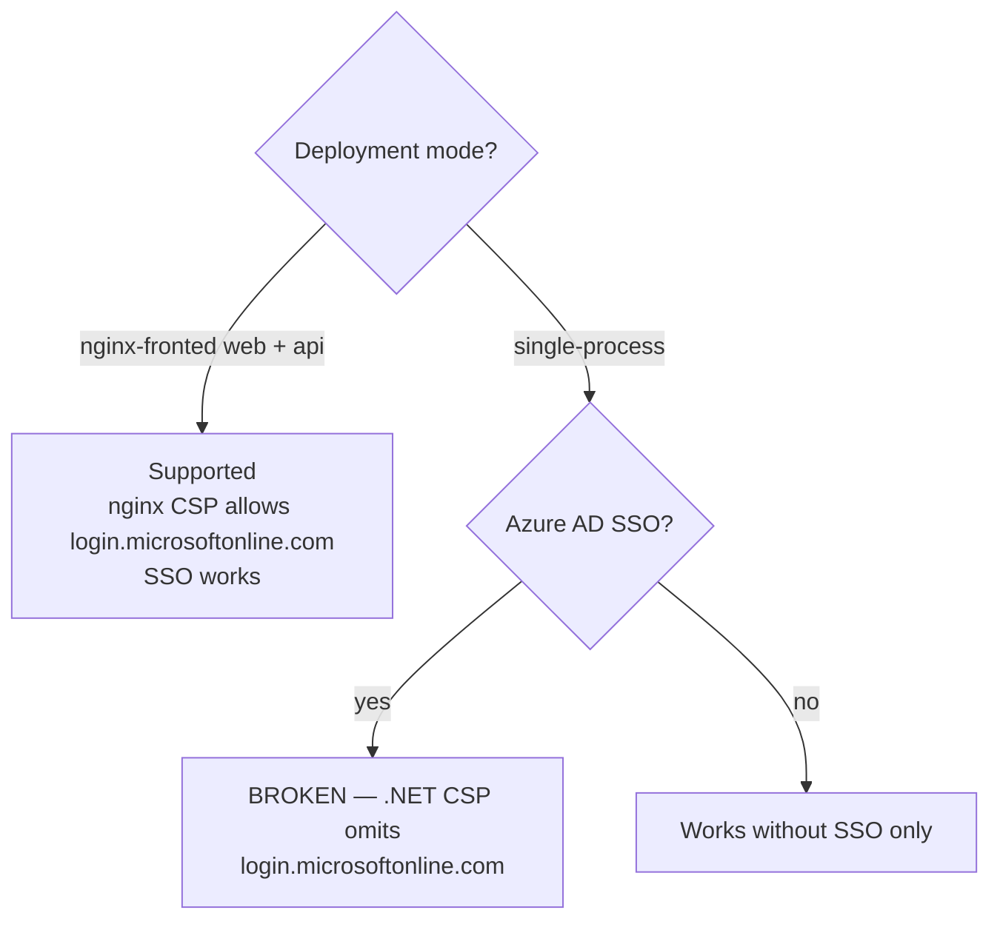

# Architecture Considerations & Trade-offs

This app is deliberately "boring": a single-instance Vue SPA + ASP.NET Core API + SQL
Server, with explicit, low-abstraction code. That simplicity is a feature, but several
choices are trade-offs that are correct *now* and will need revisiting at a specific
scale or requirement. This document records each one — what it is, why it's that way, the
real trade-off, and the concrete trigger for revisiting — so the next maintainer inherits
the reasoning, not a surprise.

**None of these are bugs. They are intentional boundaries.** Every item is grounded in the
current code, with `file:line` references so you can verify it.

**Target deployment** (all risk is calibrated to this): a single API instance, Windows
Server, SQL Server, Azure AD SSO, nginx-fronted; an internal university admissions app
serving hundreds to low-thousands of students; greenfield (no production student data yet).

**In a hurry?** The [Summary](#summary) table is the whole picture at a glance; the
[Bottom line](#bottom-line) lists the only items that need action before go-live.

**Legend:** ⚠️ = warrants attention before go-live · ✅ = addressed in code · 📋 = documented
trade-off, no action now · ⏳ = deferred, revisit on a specific trigger.

---

## Summary

| # | Consideration | Status | Revisit when… |
|---|---|---|---|
| 1 | App is its own DB migration tool | ⚠️ ⏳ | Schema must change an *existing populated* table (beyond add-new-table/index) |
| 2 | API can't horizontally scale (in-memory run state) | ⏳ | You need a 2nd API instance (HA/scale) |
| 3 | Security headers / CSP defined in two places | ⚠️ 📋 | Any CSP change → edit both copies as a pair |
| 4 | Two deployment modes; only nginx-fronted fully supported | 📋 | You ship single-process *with* SSO |
| 5 | Student sessions can't be revoked mid-life | ⏳ | A force-invalidate-one-student requirement appears |
| 6 | JSON stored in NVARCHAR columns | 📋 | You must filter by JSON contents in SQL at scale |
| 7 | Tag-match logic duplicated (C# + TS) | 📋 | The rule grows complex enough that drift is likely |
| 8 | Integration matches students by `emplid` | ⏳ | Source systems disagree on ID formatting |
| 9 | Progress via 30s polling, not push | 📋 | Real-time is required or poll fan-out grows large |
| 10 | Hand-rolled DB retry classification | 📋 | The error matrix gets unwieldy, or you move to Azure SQL/HA |
| — | Break-glass password strength enforced in Production | ✅ | (fixed) |
| — | `students.term_id` index | ✅ | (fixed) |
| — | SPA catch-all route | ✅ | (fixed) |
| — | Health-probe liveness/readiness intent | ✅ | (documented at the HEALTHCHECK) |

Plus a set of smaller documented trade-offs and cross-cutting gaps — see Parts 3 & 4.

---

## Part 1 — Core considerations

### 1. The app is its own database migration tool  ⚠️ highest-attention

**What:** On every startup the API runs `Api/Data/schema.sql` (idempotent, every object
guarded by `IF OBJECT_ID(...) IS NULL` / `IF NOT EXISTS(sys.indexes...)`) and the `Seeder`
(gated by `Database:Seed`, default true), then records a single version constant
(`SchemaInitializer.cs` — currently `2026.06.10`) in the append-only `schema_version` log.

**Why:** Zero-setup dev/test and a simple "deploy the app, schema follows" story for a
greenfield app with no real data. Building a migration engine before any production data
exists is precisely the premature abstraction the charter forbids.

**The trade-offs to know:**
- **The app applies DDL**, so its DB login needs DDL + data rights (`db_ddladmin` +
  `db_datareader`/`db_datawriter`) — not a pure read/write least-privilege account. *It does
  **not** need server-level `CREATE DATABASE`:* `EnsureDatabaseAsync` is gated by
  `Database:AutoCreate`, which defaults **off** in Production, so the DB is expected to
  pre-exist there.
- **It is additive-only, and the boundary is finer than "additive":** a brand-new *table or
  index* IS applied to an existing DB (those are separate guarded statements that re-run).
  But **adding a column to an *existing* table is silently a no-op** — the whole-table
  `IF OBJECT_ID IS NULL` guard skips the table entirely. There is no `ALTER`, no rollback,
  no backfill. `schema_version` logs a hand-bumped *constant*, not a per-script hash, so it
  won't even detect that `schema.sql` changed.

**Revisit when:** the first schema change must touch an **existing populated table** —
adding/altering a column, a type change, a `NOT NULL`/constraint addition, or any backfill.
→ Introduce an ordered, idempotent migration step (numbered `ALTER` scripts keyed off
`schema_version`, run in a maintenance window before the new app version), and consider
having a DBA provision the schema so the app login can drop to read/write-only. Also revisit
if the deployment ever becomes multi-instance (concurrent startups racing the same DDL/seed).

### 2. The API cannot be horizontally scaled as-is  ⚠️

**What:** Outbound API-check **run status** ("running"/"complete" + the list of steps
changed) is held in process memory (a `ConcurrentDictionary` in the singleton
`ApiCheckRunner`); the client polls `check-status` to render it.

**Why:** Simplest possible "trigger a background run, poll its status" for a single instance.

**Trade-off (with an important mitigation):** with two+ instances behind a load balancer, a
run started on instance A is invisible to a poll that lands on B, and the poll view is lost
on restart. **But the consequential data is already durable:** step completions/reverts go
through `Progress.ApplyAsync` (committed per-write), and the 5-minute overload throttle is
the DB column `last_api_check_at` (written at the *start* of a run). Only the cosmetic poll
view is process-local.

**Revisit when:** before deploying a second API instance (HA or load). → Move run state to a
store shared across instances keyed by student id (a small SQL table is enough).

### 3. Security headers / CSP are defined in two places  ⚠️

**What:** CSP and related security headers exist **both** in the .NET middleware
(`Program.cs` ~157-171) and in `client/nginx.conf.template` (~22-25). The nginx copy
additionally allows `connect-src login.microsoftonline.com` for MSAL/Azure AD.

**Why:** The API sets headers for its own responses; nginx sets them for the static SPA
document. Each layer owns what it emits.

**Trade-off:** two copies of a security policy can silently drift — with a real consequence
baked in (see #4).

**Revisit when:** you change the CSP for any reason. → Update **both** copies together as a
matched pair (the comment in `Program.cs` flags this), and never add a per-`location`
`add_header` in nginx without re-declaring the security headers.

### 4. There are two deployment modes; only one is fully supported  📋

**What:** The supported topology is **separate `web` (nginx) + `api` containers**.
`Program.cs` also supports a **single-process** mode (the API serves the built SPA via
`UseStaticFiles` + `MapFallbackToFile`); a cross-pointer comment already flags this in
`Program.cs` (~151-153).

**Trade-off:** the single-process fallback is second-class and untested. Critically, its CSP
(the .NET copy) does **not** allow `login.microsoftonline.com`, so **single-process mode only
works without Azure AD SSO.**

**Guidance:** for the production (Azure AD) deployment, use the **nginx-fronted** mode. Treat
single-process as an escape hatch with caveats, not the default.

**Revisit when:** you intend to ship single-process *with* SSO. → Add
`connect-src https://login.microsoftonline.com` to the .NET CSP and add coverage for that path.

### 5. Student sessions cannot be revoked mid-life (admin sessions can)  ⏳

**What:** Session tokens are stateless HS256 JWTs with an 8-hour lifetime. **Admins** are
re-checked against the DB on every request (deactivating an admin locks them out
immediately). **Students are not** — a student JWT is valid until it expires.

**Why:** Students only ever see/act on their own checklist, so the cost of statelessness is
low and the simplicity is high. (There is also no "deactivate a student" feature in the
product today, so there is nothing to enforce against.)

**Revisit when:** the product gains a deactivate/suspend-student capability, or a concrete
requirement to force-invalidate one specific student session inside 8h. → Add a per-request
revocation check (a token-version / `not-before` timestamp on the student record), accepting
the extra DB read.

### 6. JSON stored in NVARCHAR columns  📋

**What:** Several columns store JSON as `NVARCHAR`, parsed defensively in code:
step-side `links`/`required_tags`/`excluded_tags`/`contact_info`, plus `audit_log.details`
and `step_api_checks` credentials/headers.

**Note:** `students.tags` *is* filtered in SQL via substring `LIKE` in two analytics paths
(cohort comparison and tag drill-down). That `LIKE '%tag%'` is a full scan, which is fine at
this scale but is the thing that would bite first.

**Revisit when:** you must query/filter by JSON contents at scale — student count into the
tens of thousands such that the `LIKE` scan is measurable, or a need to filter/join on a
nested field. → Promote `tags` to real columns / a join table, or use SQL Server `OPENJSON`
with a computed indexed column.

### 7. Tag-matching logic is duplicated in C# and TS  📋

**What:** The tag-match predicate is implemented twice — C# `StepAppliesToStudent`
(`Api/Controllers/StepsController.cs:43-57`) and TS `stepApplies`
(`client/src/composables/useProgress.ts:20-32`). This lets the client filter steps without a
round-trip. Both are ~13 lines and behave identically (exclusion-wins; empty required-tags ⇒
applies; non-`all` mode ⇒ `any`), and the server stays authoritative.

**Revisit when:** the rule gains real complexity (negation groups, tag hierarchies,
date/term conditions) so hand-sync drift becomes likely or consequential. → Make the server
authoritative and have the client ask, or share a single spec.

### 8. Integration matches students by `emplid`  ⏳

**What:** Inbound integration matches students by `emplid` (trimmed, CI collation, via the
persisted normalized `emplid_norm` computed column). The campus ID is the stable shared key.

**Revisit when:** a real source-system feed produces `emplid` values whose formatting differs
from what's stored — symptom: integration returns `student_not_found` for students who
demonstrably exist, traced to leading-zero/padding/width differences. → Normalize on both
sides explicitly.

### 9. Progress updates via 30s polling, not push  📋

**What:** `useProgress` polls every 30s (`POLL_INTERVAL = 30000`), started only when
authenticated and torn down on logout/unmount. Each poll's `GetProgress` issues up to
**three** small queries (still cheap at this scale). No SSE/WebSocket exists.

**Revisit when:** near-real-time updates become a requirement, or concurrent active students
grow into the tens of thousands such that poll fan-out is measurable. → Consider a
`visibilitychange` pause first, then SSE/WebSockets.

### 10. Hand-rolled DB retry classification  📋

**What:** `Db.cs` hand-classifies safe-vs-ambiguous SQL error numbers for retry. Correct,
well-commented, dependency-free, and unit-tested.

**Revisit when:** a real transient fault appears carrying a SQL error number absent from both
sets, or the app moves to Azure SQL / a multi-instance topology where failover semantics
differ. → Adopt a vetted resilience library (e.g. Polly), accepting the dependency.

---

## Part 2 — Addressed in code (audit follow-ups)

These were surfaced by the audit and fixed (commit `ccf5e8a`); recorded here so the reasoning
is preserved:

- **Break-glass password strength is now enforced in Production.** A weak/placeholder
  `LocalLogin:Password` makes the break-glass endpoint behave as unconfigured (404) + logs a
  warning, mirroring the JWT/encryption-key/seeded-admin policy. (Unit-tested; dev/test
  unaffected.)
- **`students.term_id` is now indexed** (`idx_students_term`) — the admin student list and
  per-term analytics aggregations were table-scanning.
- **The SPA has a catch-all route** (`/:pathMatch(.*)*` → `/`) so unknown deep links bounce
  home instead of rendering a blank `<router-view>`.
- **The health-probe intent is documented at the `HEALTHCHECK`:** it uses `/live` (liveness)
  deliberately — restart-on-unhealthy semantics must track "process alive," not "DB
  reachable" (wiring `/ready` would restart-loop the API on a transient DB blip with no
  benefit on a single instance). `/api/health/ready` (DB-backed) is reserved for an external
  orchestrator/monitor that *routes* traffic.

---

## Part 3 — Smaller documented trade-offs (know they exist; no action now)

### Security
| Consideration | Why it's fine now | Revisit when |
|---|---|---|
| **Integration push API has no dedicated rate limit** (only the global 200/15min per-IP) | The integration caller is a trusted internal system on a known IP; 200/15min covers batch syncs | A 2nd partner is added or cadence rises → add a named policy keyed on `integrationClientId` |
| **`TestApiCheck` returns up to 2KB of the upstream body** to the configuring sysadmin (SSRF guard itself is layered + fail-closed, incl. DNS-rebinding re-check) | Only sysadmins configure checks; residual surface is small | The API-check config/test is opened to a lower-privilege role, or bodies surface to non-sysadmins |
| **Session JWT in `sessionStorage`** (`csub_token`), JS-readable → XSS could exfiltrate an 8h token | Mitigated by a strict CSP; HttpOnly cookies would force CSRF defenses and break the Bearer contract | The CSP must be loosened, or a token-revocation requirement appears → HttpOnly cookie + CSRF |
| **Integration credential scanned against all active clients** via bcrypt when `X-Client-Name` is omitted (capped at TOP 10) | The cap is a deliberate bcrypt-DoS bound; only a few clients exist | Active integration clients approach 10, or this is exposed to untrusted networks |
| **Azure AD token validation maps `oid`→admin elsewhere** (validator only checks `oid` presence) | Admin allowlisting/role assignment is in `AdminAuthController`/`Seeder`; the tenant is the trust boundary | Worth confirming the tenant is single-org so any authenticated tenant user can't self-provision |

### Operability
| Consideration | Why it's fine now | Revisit when |
|---|---|---|
| **In-flight API-check runs are dropped on shutdown** (fire-and-forget `Task.Run`, no `ApplicationStopping` hook) | Self-healing: runs are 15s-capped, each step write is its own committed idempotent op, the throttle advances at run start | Runs become long/numerous enough that a dropped mid-run leaves a student visibly stuck, or deploys get frequent → add an `ApplicationStopping` drain |
| **Logging is default console only** (no structured/JSON output or aggregation) | Capturing the container's stdout is a legitimate baseline for one instance | Incidents need cross-request correlation/search, or a 2nd instance is added → JSON console + ship to a log store. The options + interim plan live in the [observability roadmap](OPERATIONS.md#6-logging-and-observability-roadmap) |
| **Connection string sets no pool size / timeouts** (relies on SqlClient defaults; `Db.cs` already documents this) | Default pool of 100 is ample for one instance at modest concurrency | Off single-instance, or retries stack into multi-second latency → set `Max Pool Size`/`Connect`/`Command Timeout` in deploy config |
| **Container base images use floating tags** (`sdk:10.0`, `aspnet:10.0`, nginx) not digests | Fine for an internal app | You need reproducible/supply-chain-pinned builds → pin by digest |
| **Backup / DR / PITR** is operational, not code | Already assigned to the DBA in `DEPLOYMENT.md` §9–10 (full + log backups) | (Pointer only — ensure it stays in the go-live checklist) |

### Data integrity & lifecycle
| Consideration | Why it's fine now | Revisit when |
|---|---|---|
| **No `CHECK` constraints on enum columns** (`status`, `completed_by`, `role`, `auth_type`) — only defaults; app code validates | Validation is centralized per the charter and the write paths do validate | A 2nd writer, an import tool, or manual SQL becomes routine → add `CHECK` constraints as the cheapest backstop |
| **Soft-deleted steps orphan `student_progress` rows** (delete = `is_active = 0`; FK only blocks hard delete) | Deliberate: preserves historical completions for analytics; hard delete only via the guarded term-delete | Admins hit "duplicate step key" re-creating a deleted step, or counts look wrong from deactivated-step completions |
| **Students created with NULL `emplid`/`term_id`** at login; integration completions 404 until backfilled | Login must work before SIS data is linked; integration correctly reports 404/409 (no corruption) | Staff report integration completions "disappearing" for known students, or blank roadmaps → backfill flow |
| **Term activation does a full-table `UPDATE terms SET is_active = 0`** (no WHERE) inside the txn | A handful of terms, admin-only, very low concurrency — trivially cheap and atomic | A 2nd path sets `is_active`, or term count grows enough to show contention |
| **`integration_events` / `audit_log` grow unbounded** and store PII (emplid, names, bodies) | Auditability is a feature; volume is low; retention tooling now would be premature | A data-retention/PII policy is adopted, or the tables grow operationally large → add a purge job |
| **Concurrent admin edits / lost-update** beyond the single progress-write path (two admins editing the same step/term; admin completing a step while an api_check flips it) | `Progress.ApplyAsync` is correctly locked; admin-on-admin contention is rare at this scale | Multiple admins edit concurrently as a norm → add optimistic concurrency (rowversion) on step/term updates |
| **Seeder targets the *oldest* active term while runtime endpoints pick the *newest*** (`ORDER BY id` vs `ORDER BY id DESC`) — the two queries differ, so it's good to know why | They only diverge if more than one term is active at once, which nothing in the schema prevents; the seeder's ascending order is a dev-only seeding default | Two terms are intentionally active simultaneously → add a single "current term" rule (or a uniqueness guard) so seed and runtime resolve the same term |

### Performance & frontend
| Consideration | Why it's fine now | Revisit when |
|---|---|---|
| **`DeadlineRisk` analytics is N+1** (1 aggregate + 1 query per at-risk step, in a loop) | N is bounded by deadline-bearing active steps in a window — small | A term routinely has dozens of such steps, or it shows in slow-query logs → collapse into one windowed query |
| **Admin JS bundle ~1.05MB, not internally code-split** | Already behind a lazy route boundary; audience is a few internal staff | Admins report slow `/admin` first load, or the bundle grows past ~1.5MB → split the chart.js vendor chunk |
| **Student JWT expiry is server-driven only** (admin flow also checks `exp` client-side) | Correct and arguably safer (server is source of truth; transient 5xx don't log students out) | The on-load authenticated flash before a `/me` 401 becomes annoying → unify on one token-validity helper |

---

## Part 4 — Cross-cutting gaps to keep on the radar

These aren't single code sites but areas worth a deliberate decision:

- **Schema evolution of *existing* tables** — the sharper edge of #1: `schema.sql` has zero
  `ALTER` logic, so once a table holds data, evolving it needs a real (even hand-run)
  migration step. This is the one item to have a plan for *before* there's production data.
- **Accessibility / Section 508 / ADA** — a public university student app carries a legal
  accessibility obligation. The code shows partial intent (aria/roles across roadmap
  components, a high-contrast toggle, `prefers-reduced-motion` honored), but there is no
  automated a11y gate (axe/lint) and no audit of the category. Worth a dedicated pass.
- **CI/CD is parked** — `.github/workflows/ci.yml.disabled` is intentionally off, so the
  automated gate that *backstops every "defer" decision here* (build + `TreatWarningsAsErrors`
  + the real-SQL integration suite + lint) isn't running. Re-enabling it is the cheapest way
  to keep this document honest over time.
- **Client-side build supply chain** — the SPA ships heavyweight third-party runtime deps
  (tiptap, chart.js, vuedraggable, canvas-confetti, emoji-picker, DOMPurify, MSAL). No
  dependency-provenance / lockfile-integrity / CVE-scanning gate exists (CI would be the
  natural home for `npm audit` / lockfile checks).

---

## Bottom line

For a **single-instance, Windows-Server, Azure-AD** deployment, the architecture is sound and
the boring-code charter is load-bearing, not a liability. Only a few items warrant active
attention before go-live:

1. **#1 / schema evolution** — have a real migration plan in place before there's production
   data to lose.
2. **#3 / #4** — commit to the nginx-fronted deployment and keep the two CSPs in sync.
3. **Re-enable CI** — it's the safety net that keeps every "revisit when…" decision below
   actually holding.

Everything else is a documented trade-off with a clear trigger, not a latent landmine.
