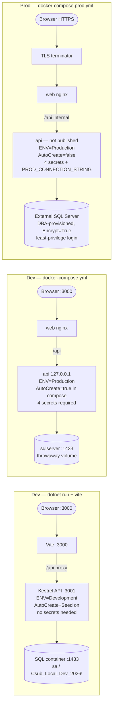
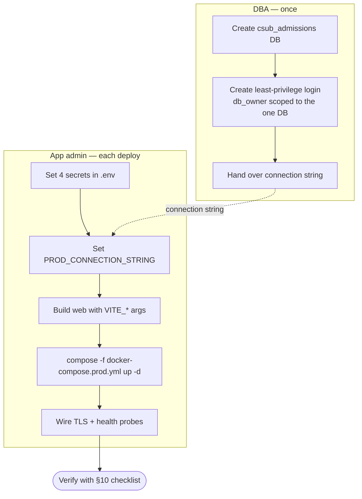
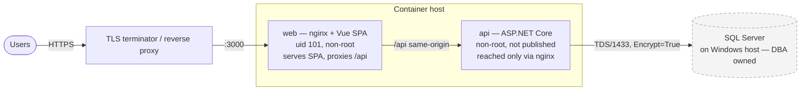

# Production Deployment

How to deploy the CSUB Runner Roadmap to production: the **application runs in Docker
containers** (a non-root nginx serving the Vue SPA, and the ASP.NET Core API), and the
**database is a real SQL Server instance on a Windows Server** — not a container.

This guide is deliberately explicit so a DBA and an app admin who have never seen the
project can stand it up safely. For local/testing setup (the all-in-one compose stack
with a containerized SQL Server) see [SETUP.md](SETUP.md); for the internals of how the
app boots and talks to the database see [ARCHITECTURE.md](ARCHITECTURE.md).

---

## At a glance: three run modes, one switch

How the app runs is decided by **`ASPNETCORE_ENVIRONMENT`**, which cascades to database
creation, seeding, and which secrets are required. There are exactly three modes — this
table is the single source of truth the other docs point to:

| | Dev — host process | Dev — full Docker | **Production** |
|---|---|---|---|
| For | active development | the whole stack locally | the real deployment |
| Start with | `dotnet run` + `npm run dev` | `docker compose up` | `docker compose -f docker-compose.prod.yml up` |
| Environment | `Development` | `Production` | `Production` |
| Containers | SQL only | web + api + sqlserver | web + api (**DB is external**) |
| Database | local SQL container | throwaway SQL container | **DBA-provisioned SQL Server** |
| `Database:AutoCreate` | `true` (default) | `true` (set in compose) | **`false`** — the DBA provisions |
| Secrets needed | none (dev defaults) | the 4 secrets | the 4 secrets + `PROD_CONNECTION_STRING` |
| Guide | [SETUP.md](SETUP.md) | [SETUP.md](SETUP.md) | **this doc** |



> **Recommended production path** — the rest of this doc is the detail behind these three steps:
> 1. **DBA** creates the database + a least-privilege login (§3) and hands over the connection string.
> 2. **App admin** sets the 4 secrets + `PROD_CONNECTION_STRING` in `.env`, builds `web` with the `VITE_*` args (§4), and runs `docker compose -f docker-compose.prod.yml up -d` (§5).
> 3. Terminate TLS in front of `web`, wire the health probes (§6–§7), and verify with the **go-live checklist** (§10).



---

## 1. Topology



- **web** and **api** are stateless containers. They can be redeployed/scaled freely.
- **SQL Server** holds all state. It is owned and backed up by the DBA team.
- The browser only ever talks to **web**; nginx reverse-proxies `/api` to **api** on the
  internal network, so there is **one origin** (no CORS to configure in the common case).
- Only **web** needs to be reachable from users (behind your TLS terminator). The **api**
  does not need a public port — it is reached through nginx on the container network.

---

## 2. The database connection model (read this first)

**Everything about how the app reaches SQL Server is driven by one connection string**
(`ConnectionStrings__Default`). There are no other DB assumptions baked into the app, so
the same build runs against SQL authentication or Windows/Integrated authentication, in a
container or on bare metal, with or without TLS. You choose by writing the connection
string.

### What the app does on startup

In order, every time the api container starts (see `Api/Program.cs`):

1. **(Optional) create the database** — only if `Database:AutoCreate` is true. **It
   defaults to `false` in Production**, so the app will *not* attempt `CREATE DATABASE`.
   A locked-down enterprise login should never have that right.
2. **Apply the schema** — runs `Api/Data/schema.sql`, which is **idempotent**
   (`IF OBJECT_ID(...) IS NULL CREATE TABLE ...`). Re-running it never drops or alters
   existing data. The applied version is recorded in a `schema_version` table for
   auditability (append-only; never destructive).
3. **(Optional) seed bootstrap data** — only if `Database:Seed` is true (default true).
   Seeds a default term, the checklist, the default admin, and the integration client —
   but only on an *empty* database. Set `Database:Seed=false` if your DBA seeds out-of-band.

> **Implication for permissions:** because the app applies its own schema on startup, its
> login needs DDL rights **inside its one database**. The clean least-privilege choice is
> `db_owner` *scoped to that single database* (this is database-level, not the server-wide
> `sysadmin`). See the provisioning script below. If your security posture forbids even
> that, have the DBA apply `schema.sql` once and grant `db_ddladmin + db_datareader +
> db_datawriter`; the startup schema apply then finds everything already present.

---

## 3. DBA tasks — provision the database and a least-privilege login

Run **once**, by a DBA, on the SQL Server. Pick the auth model your environment uses.

### Option A — SQL authentication (most portable; works from Linux containers)

```sql
-- 1. Create the database (the app will NOT do this in Production).
CREATE DATABASE csub_admissions;
GO

-- 2. A dedicated login for the app. Use a strong, unique password.
CREATE LOGIN csub_app WITH PASSWORD = 'REPLACE_WITH_A_STRONG_SECRET';
GO

-- 3. Map it into the one database and grant DB-scoped ownership so the app can
--    apply its idempotent schema on startup. This is NOT server-wide sysadmin.
USE csub_admissions;
CREATE USER csub_app FOR LOGIN csub_app;
ALTER ROLE db_owner ADD MEMBER csub_app;
GO
```

Connection string (api container env `ConnectionStrings__Default`):

```
Server=SQLHOST.your.domain,1433;Database=csub_admissions;User Id=csub_app;Password=REPLACE_WITH_A_STRONG_SECRET;Encrypt=True;TrustServerCertificate=False
```

### Option B — Windows / Integrated authentication

Best when the **app runs on Windows** as a domain service account (no password in the
connection string). Running Integrated auth from a **Linux container** additionally
requires Kerberos configuration in the container and is uncommon — prefer Option A for
the containerized deployment, and Option B when hosting the api directly on Windows.

```sql
CREATE LOGIN [YOURDOMAIN\svc-csub-app] FROM WINDOWS;
GO
USE csub_admissions;
CREATE USER [YOURDOMAIN\svc-csub-app] FOR LOGIN [YOURDOMAIN\svc-csub-app];
ALTER ROLE db_owner ADD MEMBER [YOURDOMAIN\svc-csub-app];
GO
```

Connection string:

```
Server=SQLHOST;Database=csub_admissions;Integrated Security=True;Encrypt=True;TrustServerCertificate=False
```

### Encryption (`Encrypt` / `TrustServerCertificate`)

`Microsoft.Data.SqlClient` defaults to `Encrypt=True` — keep it on in production.

| Setting | Encrypted | Cert validated | When to use |
|---|---|---|---|
| `Encrypt=True;TrustServerCertificate=False` | Yes | Yes | **Recommended.** Needs SQL Server to present a cert the app host trusts (your CA, or the SQL cert in the host's trust store). |
| `Encrypt=True;TrustServerCertificate=True` | Yes | No | Stopgap for a self-signed cert — no protection against man-in-the-middle. Plan to install a real cert. |
| `Encrypt=False` | No | — | Never in production. The local compose stack uses it only because SQL is a throwaway container on localhost. |

---

## 4. Application configuration & secrets

The api container runs in `Production` (`ASPNETCORE_ENVIRONMENT=Production`) and
**refuses to start with missing or weak secrets** — this is intentional. Provide config
as environment variables using the ASP.NET Core double-underscore syntax (`Section__Key`).

| Variable | Required | Purpose |
|----------|----------|---------|
| `ConnectionStrings__Default` | **Yes** | The connection string from §3 |
| `Jwt__Secret` | **Yes** | HS256 signing secret, ≥ 32 random chars. Generate: `openssl rand -base64 48` |
| `Admin__DefaultEmail` / `Admin__DefaultPassword` | **Yes** (password) | The first admin, seeded on an empty DB. The seeder rejects weak/known-default passwords in Production |
| `ApiCheck__EncryptionKey` | **Yes** | 64 hex chars (32 bytes) used to encrypt stored API-check credentials at rest. Generate: `openssl rand -hex 32` |
| `Database__AutoCreate` | No | `false` in Production by default — leave unset so the app does not attempt `CREATE DATABASE` |
| `Database__Seed` | No | `true` by default; set `false` if the DBA seeds the bootstrap data manually |
| `LocalLogin__Username` / `LocalLogin__Password` | No | Optional break-glass local admin login. **Disabled unless both are set.** Use only if you need a non-SSO admin path |
| `AzureAd__ClientId` / `AzureAd__TenantId` | No | Enables Azure AD SSO token validation on the API. Omit to disable (SSO endpoints then return 501) |
| `AzureAd__EmplidClaim` | No | The id-token claim carrying the student's emplid (e.g. `employeeId` or an extension attribute). When set, sign-in links a pre-staged student to their account by emplid (our primary identifier); unset → linking falls back to email |
| `Integration__DefaultName` / `Integration__DefaultKey` | No | Seeds an integration client for the inbound push / outbound API-check features |
| `Cors__Origin` | No | Only needed if the SPA is served from a **different** origin than the API. In the standard same-origin nginx setup, leave it unset |

> **Variable names in `.env` vs. direct environment:** the table above shows the
> ASP.NET `Section__Key` names, which is what you set when running the api image under
> an orchestrator. The compose files map friendlier `.env` names onto them — e.g.
> `AZURE_AD_CLIENT_ID` → `AzureAd__ClientId`, `CORS_ORIGIN` → `Cors__Origin`,
> `INTEGRATION_DEFAULT_KEY` → `Integration__DefaultKey`, and (prod compose)
> `PROD_CONNECTION_STRING` → `ConnectionStrings__Default`. `.env.example` lists every
> `.env` name.

> **Never commit real secrets.** Inject them from your platform's secret store (e.g. a
> `.env` file with locked-down permissions on the host, Docker/compose secrets, or your
> orchestrator's secret mechanism). `.env.example` documents every variable.

### Frontend config is baked in at BUILD time

Vite **inlines** `VITE_*` values into the JavaScript bundle when the SPA is built — they
are *not* read at runtime. So the web image must be **built** with the right values
(passed as Docker build args), not just have env vars set when it runs:

| Build arg | Purpose |
|-----------|---------|
| `VITE_AZURE_AD_CLIENT_ID` | Azure AD app (client) ID for browser-side SSO. Must match `AzureAd__ClientId` on the API |
| `VITE_AZURE_AD_TENANT_ID` | Azure AD tenant ID |
| `VITE_AZURE_AD_REDIRECT_URI` | Your deployed origin, e.g. `https://roadmap.csub.edu/` |
| `VITE_ALLOW_DEV_LOGIN` | **Keep `false`** for any real deployment. The dev-login form is a development convenience; the API 404s that endpoint outside Development anyway |

These are wired through `client/Dockerfile` (ARG/ENV) and `docker-compose.yml`
(`web.build.args`), sourced from `.env`.

---

## 5. Build and run the containers

In production you typically run only **web** + **api** as containers and point the API at
the external SQL Server — so you would *not* start the compose `sqlserver` service.

### Option A — the production compose file (recommended)

Use **[`docker-compose.prod.yml`](../docker-compose.prod.yml)** — a standalone stack with
**only web + api**, no `sqlserver` service, and the connection string read from `.env`:

```bash
cp .env.example .env
# In .env set: PROD_CONNECTION_STRING (from §3), JWT_SECRET, ADMIN_DEFAULT_PASSWORD,
# API_CHECK_ENCRYPTION_KEY, and the VITE_* build args if using SSO.
docker compose -f docker-compose.prod.yml up -d --build
```

> **Do not use the default `docker-compose.yml` for production.** It exists for
> local/testing: its api service hardcodes the connection string to the throwaway
> `sqlserver` container (a `ConnectionStrings__Default` entry in `.env` is ignored),
> sets `Database__AutoCreate=true`, and `depends_on` would start that container even
> with `docker compose up web api`. The prod file has none of that: AutoCreate stays
> off (Production default), the api container is not published, and the database
> stays **out** of the container set.

> **Use the nginx-fronted topology (web + api) — not single-process.** The API *can*
> serve the SPA itself, but that mode is unsupported for production: its in-process CSP
> omits `login.microsoftonline.com`, so **Azure AD SSO breaks**. Also note the CSP lives
> in **two files** — `Api/Program.cs` and `client/nginx.conf.template` — edit them as a
> matched pair whenever you change it. (Reasoning: [ARCHITECTURE-CONSIDERATIONS.md](ARCHITECTURE-CONSIDERATIONS.md).)

### Option B — build images in CI, run with your orchestrator

```bash
# Frontend image — build args are required because Vite inlines them.
docker build -t registry.example/csub-web:TAG \
  --build-arg VITE_AZURE_AD_CLIENT_ID=... \
  --build-arg VITE_AZURE_AD_TENANT_ID=... \
  --build-arg VITE_AZURE_AD_REDIRECT_URI=https://roadmap.csub.edu/ \
  --build-arg VITE_ALLOW_DEV_LOGIN=false \
  ./client

# Backend image.
docker build -t registry.example/csub-api:TAG ./Api
```

Run them under your orchestrator with the env vars from §4. Both images:

- run as a **non-root** user (web = uid 101 `nginx`, api = the .NET `app` user),
- expose **8080** (web nginx listens on 8080; api Kestrel listens on 8080),
- declare a Docker **`HEALTHCHECK`** (see §6).

Publish web's `8080` behind your TLS terminator; api's `8080` only needs to be reachable
by web on the internal network.

---

## 6. Health probes

The API exposes two endpoints (see `Api/Controllers/HealthController.cs`):

| Endpoint | Meaning | Use for |
|----------|---------|---------|
| `GET /api/health/live` | Process is up. Always `200`. Does **not** touch the DB | Liveness probe / Docker `HEALTHCHECK` |
| `GET /api/health/ready` | Probes the database. `200 {status:"ready",db:"connected"}` when reachable, `503` when not | Readiness probe / load-balancer gating |

- The container `HEALTHCHECK` uses **liveness** so a brief DB blip doesn't get the
  container killed (the API also has transient-fault retry on SQL — see ARCHITECTURE.md).
- Wire your **orchestrator's readiness probe** to `/api/health/ready` so traffic is held
  until the database is actually reachable.
- Kubernetes example: `livenessProbe` → `/api/health/live`, `readinessProbe` →
  `/api/health/ready`.
- The readiness probe is **fast by design**: it uses its own dedicated connection with
  a 3-second connect/command timeout and bypasses the app's transient-retry layer, so a
  down database reports `503` within seconds (not after a minute of retries).

---

## 7. TLS, reverse proxy, and forwarded headers

- **Terminate TLS** at a reverse proxy / load balancer in front of the **web** container
  (nginx ingress, IIS ARR, Azure App Gateway, a cloud LB, etc.). The app sends HSTS
  (`Strict-Transport-Security`) and a strict CSP already (see `Api/Program.cs`).
- The API honors `X-Forwarded-For` / `X-Forwarded-Proto` (`UseForwardedHeaders`) so rate
  limiting and audit logging record the **real client IP**, not the proxy's. The internal
  nginx already sets these headers; if you add another proxy layer, make sure it forwards
  them too.
- Because the API trusts forwarded headers unconditionally (it is only reachable through
  the trusted internal nginx), **do not expose the api container's port publicly.** Keep
  it on the internal network only.
- If your topology ever requires exposing the api more widely, set
  `ForwardedHeaders__KnownNetworks` to the proxy's CIDR list (semicolon-separated, e.g.
  `"172.16.0.0/12;10.0.0.0/8"`). The API then only honors `X-Forwarded-*` from those
  networks, so a direct caller cannot spoof its IP to dodge per-IP rate limiting.

---

## 8. Schema upgrades

The schema is applied on every startup and is idempotent, so a routine deploy needs no
manual DB step:

1. The DBA's database and login already exist (§3).
2. Deploy a new api image. On startup it re-applies `schema.sql` (adds any new tables /
   indexes via `IF NOT EXISTS`; never drops anything) and records the version in
   `schema_version`.
3. For a change that genuinely alters existing data/columns (a true migration beyond
   "add if missing"), have the DBA run that change in a maintenance window **before**
   deploying the image that depends on it. The startup apply is additive, not a full
   migration engine.

Roll back by deploying the previous image tag; because the schema apply is additive, an
older image continues to work against the newer schema in the common case.

---

## 9. Backups, logging, monitoring

- **Backups** are the DBA's responsibility on the SQL Server (full + log backups per your
  RPO/RTO). The app stores nothing outside the database that needs backing up.
- **Logging** uses the standard ASP.NET Core `ILogger`, written to stdout/stderr — collect
  container logs with your platform's log driver. Errors and failed outbound API checks are
  logged at `Warning`/`Error`; unhandled request errors are caught and logged centrally.
- **Monitoring** — scrape the health endpoints (§6). Watch for `503` on
  `/api/health/ready` (database connectivity) and for container `HEALTHCHECK` failures.

---

## 10. Go-live checklist

- [ ] DBA has created the database and a **least-privilege login** scoped to it (§3).
- [ ] `ConnectionStrings__Default` uses `Encrypt=True` and (ideally)
      `TrustServerCertificate=False` with a trusted cert (§2–§3).
- [ ] `Jwt__Secret` (≥32 random chars), `ApiCheck__EncryptionKey` (64 hex), and a strong
      `Admin__DefaultPassword` are set from your secret store — **no defaults** (§4).
- [ ] `Database__AutoCreate` is unset/false in Production (DBA owns provisioning).
- [ ] The **web image was built** with the correct `VITE_AZURE_AD_*` values and
      `VITE_ALLOW_DEV_LOGIN=false` (§4).
- [ ] `AzureAd__ClientId` / `AzureAd__TenantId` on the API match the frontend's, if using SSO.
- [ ] TLS is terminated in front of **web**; the **api** port is not publicly exposed (§7).
- [ ] Readiness probe points at `/api/health/ready`; liveness at `/api/health/live` (§6).
- [ ] First login works (SSO and/or the seeded admin), the student roadmap renders, an
      admin edit saves, analytics charts load, a CSV export downloads, and one integration
      API call succeeds.
- [ ] DBA backup schedule is in place; container logs are being collected.
