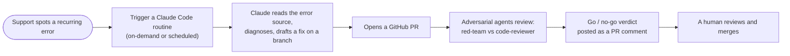

# Operations & Support Runbook

> **Who this is for:** the Support team — the first responders who keep the Runner Roadmap healthy day to day. The goal is to see what's happening, resolve the common issues yourself, and escalate the rest with enough detail for a clean handoff. New to the app? Start at the [docs home](README.md).

## 1. Is it up?

Two health endpoints answer different questions:

| Check | URL | Green | Red means | First action |
|-------|-----|-------|-----------|--------------|
| Liveness | `/api/health/live` | `200 {status:"ok"}` | the process itself is down or hung | restart the api service; if it won't stay up it's almost always a bad secret/config — see §4 and escalate |
| Readiness | `/api/health/ready` | `200 {status:"ready", db:"connected"}` | process is up but **can't reach the database** | check SQL Server is up/reachable; the app reconnects on its own once the DB is back — no restart needed |

Rule of thumb: **`/live` red → restart the app. `/ready` red → check the database, not the app.** Detail: [ARCHITECTURE → Health Probes](ARCHITECTURE.md#health-probes-healthcontrollercs).

## 2. Where to look (today)

The app currently writes logs to **standard output** — there's no aggregator yet (see §6 for the plan). Read them where it runs:

- **Containers:** `docker compose logs api` (add `-f` to follow, `--since 15m` to limit). Web tier: `docker compose logs web`.
- **Windows Server + IIS:** the API's stdout is captured by the ASP.NET Core Module (the site's `logs\stdout` folder); startup/crash events also land in **Windows Event Viewer → Application**.

**Audit history** (Admin UI → Audit Log, backed by the `audit_log` table) is a second, in-app signal. It answers **"did this action happen, and who did it"** — who completed/uncompleted a step, who changed a term — *not* "why did the app throw." Two caveats: it only records in-app actions, and it lives in the database, so it's unavailable exactly when the app or DB is down. Use it to confirm or deny a reported change, not as an error log.

## 3. Quick reference

| Need | Command / location |
|------|--------------------|
| Health | `GET /api/health/live`, `GET /api/health/ready` |
| Logs (containers) | `docker compose logs api --since 30m` |
| Restart API (containers) | `docker compose restart api` |
| Who-did-what | Admin UI → Audit Log |

## 4. Symptom → likely cause → action

Conservative actions only — check, restart, or escalate. Nothing here deletes data.

| Symptom | Likely cause | What to check | Action |
|---------|--------------|---------------|--------|
| API won't start / crashes on boot | Missing or weak required secret (`Jwt:Secret`, `ApiCheck:EncryptionKey`, admin/break-glass password) — the app **fails fast** in Production by design | the startup log line naming the bad/missing key | this is config, not a code bug → escalate to whoever owns the deployment secrets |
| `/api/health/ready` returns 503 | Database unreachable | is SQL Server up? network/firewall? credentials? | bring the DB back; the app reconnects on its own (it retries) — no app restart needed |
| Users can't sign in via SSO | Entra (Azure AD) misconfig, or the `studentId` claim isn't being sent | recent Entra changes; the SSO failure line in the log | escalate to the EApps/identity owner with the log line |
| An outbound API check always fails | Target down, or the URL resolves to a private/internal IP (rejected by design) | the check's URL and the rejection reason in the log | "Resolved to private IP" = expected safety behavior, fix the URL; otherwise it's a target-side issue |
| Bursts of `429 Too Many Requests` | Rate limit tripped (200 per 15 min per IP; tighter on login) | what's the source IP — a real user, a script, or abuse? | legitimate spike → escalate to raise the limit; abusive → block upstream |
| Page is blank / assets 404 | SPA/proxy issue (e.g. `API_URL` has a trailing slash) or a bad deploy | browser console + `docker compose logs web` | escalate with the console errors; check the last deploy |

## 5. Escalation

When you can't resolve it, capture the following and hand it to the EApps/dev team. It gives them what they need to act without another round of questions:

```
When:        <date/time + timezone>
Symptom:     <what the user saw / what's broken>
Scope:       <one user? everyone? one term/cohort?>
Health:      /live = <ok|down>   /ready = <ready|503>
Logs:        <the relevant lines — copy 10-20 lines around the error>
Recent:      <any deploy, config, or Entra change in the last 24h>
Tried:       <what you already checked or did>
```

## 6. Logging and observability roadmap

> This is the *plan* — **not built yet.** We have not chosen a logging tool; this section lays out the options and an interim approach so the decision can be made deliberately. For now, logs go only to stdout (§2).

Think in three layers:

| Layer | Question | Status |
|-------|----------|--------|
| **Health** | Is it up? | exists (`/health/*`) |
| **Logs** | What happened / why did it throw? | the gap — stdout only |
| **Audit** | Who did what in-app? | exists (`audit_log`); triage aid only |

**Interim plan:** aggregate the container/server logs onto a **separate box** — somewhere that stays up when the app host doesn't, so logs survive an outage (the audit table can't — see §2).

**When we start, do this one enabling step first:** switch the app to **structured (JSON) console logging**. It's a small, low-risk change, and it lets *any* of the tools below ingest the logs cleanly.

**Options (no pick — decide with the checklist):**

| Option | Best when |
|--------|-----------|
| **Sentry / GlitchTip** (GlitchTip self-hosts, Sentry-compatible) | you want error grouping + alerting and like the Sentry model |
| **Azure Application Insights / Monitor** | you lean into the Azure/Entra stack; hosted, searchable, alerting |
| **Seq** | smallest self-hosted, .NET-native structured-log viewer |
| **Grafana Loki** | infrastructure already runs Grafana |
| **Existing CSUB logging software** | institutional tooling already exists — prefer reusing it |

**Decision checklist:** runs on a separate box · survives an app-host outage · ingests structured JSON · searchable with history · supports alerting · has a clear owner.

## 7. Claude-assisted remediation

> The *model* — **not wired up yet.** This is the intended Support "fix it" path once the prerequisites below exist. Documented now so we build toward it deliberately.

The idea: when Support sees a *recurring* error, they trigger a Claude Code routine that diagnoses it and opens a **human-reviewable** pull request, with adversarial agents posting a go/no-go verdict — so the same problem gets a candidate fix without a direct report to the dev team, and a human still approves every merge.



**Guardrails:**
- **A human always merges.** Nothing auto-merges.
- The adversarial verdict is **advisory** — it informs the human, it is not a self-approving gate.
- Fixes arrive as ordinary reviewable PRs on a branch, never straight to `main`.

**Prerequisites (why it's deferred):**
1. **An error source Claude can read** — the logging roadmap (§6) in place, even just the interim aggregation.
2. **A GitHub repo that receives PRs** — the repo pushed, with a branch/PR workflow.
3. **A human reviewer/merger** on the Support or dev side.

When those exist, the build is a small Claude Code routine (a scheduled trigger or an on-demand command) running a diagnose → branch → PR → adversarial-review workflow. See [Working with Claude Code](WORKING-WITH-CLAUDE.md).
