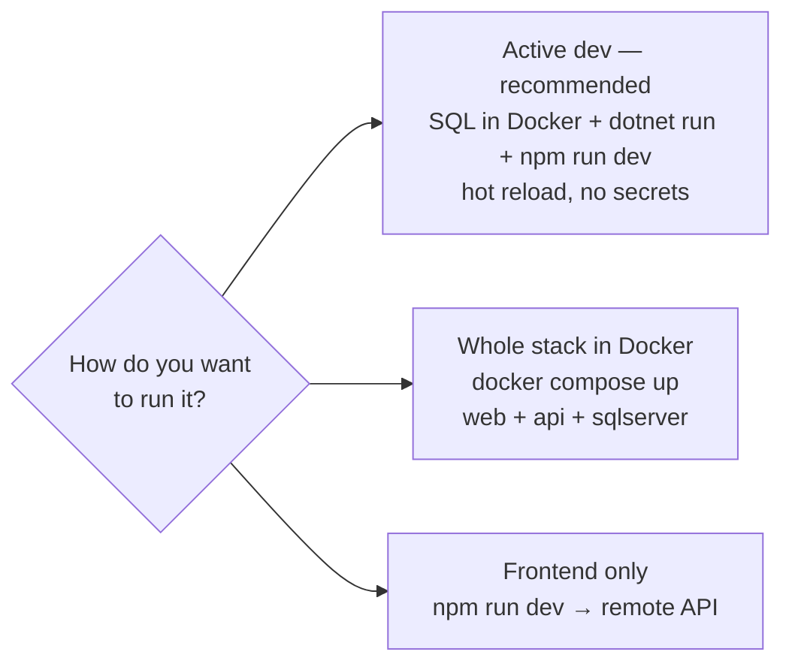
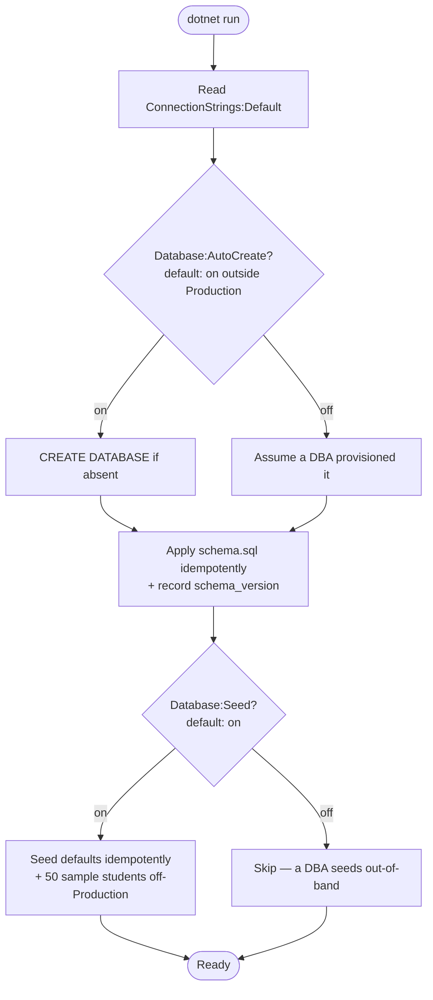

# Development Setup Guide

This guide gets the CSUB Runner Roadmap running locally and is your day-to-day
reference for the pre-push quality commands (tests, lint, format) and the startup
flags (`Database:AutoCreate`, `Database:Seed`). For how the pieces fit together see
[Architecture](ARCHITECTURE.md); to ship to a Windows Server + SQL Server see
[Deployment](DEPLOYMENT.md).

**Pick your path:**



The app has three pieces — **web** (Vue 3 client), **api** (ASP.NET Core .NET 10 +
Dapper), **sqlserver** (SQL Server 2022). In dev you usually run SQL in a container
and the API + client as host processes; in production all three are containers.

## Prerequisites

| Tool | Version | Needed for |
|------|---------|------------|
| **.NET SDK** | **10.0** | Building/running the ASP.NET Core API and the xUnit test project |
| **Node.js** | **20+** (LTS) and **npm 9+** | Building/running/testing/linting the Vue 3 client |
| **Docker** | Rancher Desktop **or** Docker Desktop | Running SQL Server locally, and the full containerized stack |

You only need .NET and Node if you intend to run the API/client directly on the
host. To run the entire stack you only need Docker. To run *just the frontend*
(see [Running the frontend on its own](#running-the-frontend-on-its-own-eg-a-windows-desktop)),
you only need Node.

> Running the SQL Server container on a Mac needs one VM setting — see the
> [Troubleshooting](#troubleshooting) table if the container crashes on startup.

## Quick Start (full stack in Docker)

The simplest way to see the whole app is to build and run all three containers.

**First set your secrets.** The `api` container runs in Production and refuses to start with
missing or weak secrets, so copy the template and fill it in (generate values, e.g.
`openssl rand -base64 48` for the JWT secret and `openssl rand -hex 32` for the API-check key):

```bash
cp .env.example .env        # then edit .env and set MSSQL_SA_PASSWORD, JWT_SECRET, ADMIN_DEFAULT_PASSWORD, API_CHECK_ENCRYPTION_KEY
# Build the client + API images and start everything (SQL Server, API, web)
docker compose up --build
```

Then open **[http://localhost:3000](http://localhost:3000)**. (Compose will stop with a clear
message if a required secret is unset.) For purely local development without containers you don't
need any of this — `dotnet run` + `npm run dev` use the dev defaults (see below).

What this does:

- Starts **`sqlserver`** (SQL Server 2022) on `localhost:1433`.
- Builds and starts **`api`** (ASP.NET Core) on `localhost:8080`. On startup it
  waits for SQL Server to become healthy, then creates the `csub_admissions`
  database, applies the schema (`Api/Data/schema.sql`), and seeds default data.
- Builds and starts **`web`** (the Vue bundle served by nginx) on
  `localhost:3000`. nginx reverse-proxies any request under `/api` to the `api`
  container, so the browser only ever talks to a **single origin** — there is
  **no CORS** to configure.

Because the client always calls **relative `/api` URLs** (proxied by nginx in
containers, and by Vite in local dev), no API URL is hardcoded anywhere in the
frontend.

### Starting the containers individually

`depends_on` wiring means you can bring up any single service and Docker will
pull in everything it needs:

```bash
# Just the database (:1433)
docker compose up -d sqlserver

# Database + API (:8080) — depends_on starts sqlserver first and waits for health
docker compose up -d --build api

# Full stack (:3000) — depends_on pulls in api, which pulls in sqlserver
docker compose up -d --build web
```

This is handy when you want, for example, the containerized database and API but
the client running from source with hot reload (see the next section).

### Stopping and resetting

```bash
docker compose down           # stop and remove the containers (keeps the DB volume)
docker compose down -v        # also delete the csub_sqlserver_data volume (fresh DB next start)
docker compose logs -f api    # follow the API logs (schema + seed output appears here)
```

The database lives in the named volume `csub_sqlserver_data`, so data survives
`docker compose down`. Use `down -v` when you want the API to re-create and
re-seed a clean database on the next boot.

## Local development without containers

For the tightest edit/run loop, run SQL Server in Docker but run the API and the
client directly on the host:

```bash
# 1. Start SQL Server (Docker). Requires MSSQL_SA_PASSWORD in .env — use
#    Csub_Local_Dev_2026! locally so dotnet run / dotnet test match (see Database Setup).
docker compose up -d sqlserver

# 2. Run the API (creates DB + schema + seed on first boot)
cd Api && dotnet run                       # http://localhost:3001

# 3. In another terminal, run the Vue client
cd client && npm install && npm run dev    # http://localhost:3000
```

The client runs at [http://localhost:3000](http://localhost:3000) and proxies
`/api` calls to the API at **port 3001** (configured in
`client/vite.config.ts`). The proxy target defaults to `http://localhost:3001`
and can be overridden with the `VITE_API_PROXY_TARGET` environment variable.

There is **no manual database setup**: on startup the API ensures the
`csub_admissions` database exists, applies the schema (`Api/Data/schema.sql`),
and seeds default data (admin account, integration client, Fall 2026 checklist,
and — when not running in Production — 50 sample students). The break-glass local
admin is **not** seeded: it is enabled by the `LocalLogin:Username`/`Password`
config values (defaulted in `appsettings.Development.json`). No `createdb`, migrations, or hand-run scripts are required. The
exact boot sequence and the flags that control it are described under
[What the API does on startup](#what-the-api-does-on-startup).

> **Why two different API ports?** In local dev the API listens on **`:3001`**
> (set via `Urls` in `appsettings.Development.json`), which is what the Vite
> proxy targets by default. In containers the API listens on **`:8080`** (set
> via `ASPNETCORE_URLS` in `Api/Dockerfile`), and nginx proxies to it there.

## What the API does on startup

Everything the API needs from the database is created **idempotently on boot** — no
separate migration or provisioning step in development. `Api/Program.cs` runs:



Two flags control this; set them in `appsettings*.json` or as `Database__AutoCreate` /
`Database__Seed` env vars:

| Flag | Default | What it does |
|------|---------|--------------|
| `Database:AutoCreate` | on outside Production | Whether the app runs `CREATE DATABASE` when the DB is absent. Applying `schema.sql` runs either way. Set `false` locally to rehearse the production flow against a DB you pre-create. |
| `Database:Seed` | on (everywhere) | Whether the idempotent seeder inserts the default term/checklist/admin/integration client (+ 50 sample students outside Production). Set `false` to test empty-state behavior. |

In production both are typically off or DBA-handled — see [Deployment](DEPLOYMENT.md).

## Database Setup

### Local SQL Server via Docker (recommended)

```bash
docker compose up -d sqlserver
```

This starts **SQL Server 2022** on `localhost:1433`. The SA password is **required —
compose has no default**: copy `.env.example` to `.env` and set `MSSQL_SA_PASSWORD`
first. For the host-process dev loop, set it to **`Csub_Local_Dev_2026!`** — that is
the password hardcoded in `Api/appsettings.Development.json` (used by `dotnet run`)
and in the integration-test fixture (`tests/Api.IntegrationTests/WebAppFixture.cs`),
so a different value breaks `dotnet run` and `dotnet test` until you update those too.
Data persists in the `csub_sqlserver_data` volume. The compose file defines a
health check (`sqlcmd ... SELECT 1`) so the API can wait for the database to be
ready before it starts.

The connection string is preconfigured for local dev in
`Api/appsettings.Development.json`:

```
Server=localhost,1433;Database=csub_admissions;User Id=sa;Password=Csub_Local_Dev_2026!;TrustServerCertificate=True;Encrypt=False
```

In the `api` container the connection string instead targets the
`sqlserver` service name (`Server=sqlserver,1433;...`), supplied via the
`ConnectionStrings__Default` environment variable in `docker-compose.yml`. The
connection string is the single switch that drives **all** DB connectivity — SQL
auth or Windows auth, `Encrypt=True/False`, certificate trust — so changing
environments is a one-line change with no code edits.

The database, schema, and seed data are applied automatically on first API start
— no `createdb`, migrations, or manual scripts required (see
[What the API does on startup](#what-the-api-does-on-startup)).

### Confirm it's up

Once the API is running, the health endpoints report status. There are two,
each with a different job (defined in `Api/Controllers/HealthController.cs`):

| Endpoint | Touches DB? | Returns | Use for |
|----------|-------------|---------|---------|
| `GET /api/health/live` | No | always `200` | liveness — is the process up at all? |
| `GET /api/health/ready` | Yes | `200` ready, `503` when DB is down | readiness — can it actually serve requests? |

```bash
# Local dev (dotnet run)
curl http://localhost:3001/api/health/ready   # probes the DB; 503 if it can't connect

# Containerized API directly
curl http://localhost:8080/api/health/ready

# Through the web container (nginx proxy)
curl http://localhost:3000/api/health/ready
```

If `/api/health/ready` returns `503` but `/api/health/live` returns `200`, the
process is fine but it can't reach SQL Server — check that the `sqlserver`
container is healthy and that your connection string is correct.

## Running the App

The run commands are above — **[Quick Start](#quick-start-full-stack-in-docker)** for the
full Docker stack, **[Local development without containers](#local-development-without-containers)**
for the host-process loop (`dotnet run` on `:3001` + `npm run dev` on `:3000`), and
[Starting the containers individually](#starting-the-containers-individually) to bring up
one service at a time.

One dev-only extra: the API exposes its raw OpenAPI document at `/openapi/v1.json` (no docs
UI is mapped), and `dotnet build` compiles without running.

## Developer quality workflow

Before pushing, run the same checks the (currently parked) CI workflow is set up to
run (`.github/workflows/ci.yml.disabled` builds and tests both halves). With CI off for
now, running these locally is how the build stays honest. The frontend and backend each have their own tooling;
this section is the day-to-day reference for all of it.

### Frontend npm scripts (`client/`)

All scripts are defined in `client/package.json`. Run them from the `client/`
directory.

| Script | Command it runs | What it does |
|--------|-----------------|--------------|
| `npm run dev` | `vite` | Start the Vite dev server on `:3000` with hot reload, proxying `/api` to `VITE_API_PROXY_TARGET` (default `:3001`). |
| `npm run build` | `vue-tsc -b && vite build` | Type-check the whole project (`vue-tsc`) **then** produce the production bundle. A type error fails the build — this is the gate the `web` image build relies on. |
| `npm run preview` | `vite preview` | Serve the already-built `dist/` locally to sanity-check a production bundle. |
| `npm run test` | `vitest run` | Run the Vitest unit suite **once** and exit. This is the CI form. |
| `npm run test:watch` | `vitest` | Run Vitest in watch mode — re-runs the affected tests as you edit. Use this while developing. |
| `npm run lint` | `eslint .` | Lint with the flat ESLint config (`eslint.config.js`). ESLint owns *correctness* rules; `skip-formatting` hands *layout* to Prettier so the two don't fight. |
| `npm run format` | `prettier --write src` | Rewrite files under `src/` to match Prettier's style (no semicolons, single quotes, 100-col, trailing commas — see `.prettierrc.json`). |
| `npm run format:check` | `prettier --check src` | Verify formatting **without** changing files. Exits non-zero if anything is mis-formatted — this is what CI runs. |

A typical pre-push loop:

```bash
cd client
npm run lint          # correctness
npm run format:check  # layout (use `npm run format` to auto-fix)
npm run test          # unit tests, run-once
npm run build         # type-check + bundle
```

**About the unit tests.** Vitest is configured in `client/vite.config.ts`: it
picks up `src/**/*.test.ts` and runs them under **jsdom**, so stores and
composables that touch `sessionStorage`, `fetch`, and timers behave like the
browser. The current suite covers the Pinia stores and composables, e.g.
`src/stores/auth.test.ts`, `src/stores/toast.test.ts`,
`src/composables/useProgress.test.ts`, and
`src/composables/useAdminApi.test.ts`. These run with **no API and no database**
— they mock the network — so they're fast and safe to run anywhere.

### Backend tests (`dotnet test`)

The backend has an xUnit **integration** test project
(`tests/Api.IntegrationTests`). Unlike the frontend unit tests, these spin up the
real API in-process (via `WebApplicationFactory`, see `WebAppFixture.cs`) and
exercise it against a **real SQL Server**, so the `sqlserver` container must be
running first:

```bash
# 1. Start SQL Server if it isn't already
docker compose up -d sqlserver

# 2. Run the integration suite
dotnet test                       # from the repo root, against CsubRunnerRoadmapV2.slnx
# (run it from the repo root — Api/ contains only the app project, so a
#  `dotnet test` from inside Api/ would not discover the xUnit suite)
```

The suite covers auth, admin endpoints, integrations, API-checks, and security
hardening (e.g. `AuthTests.cs`, `AdminUsersTests.cs`, `SecurityHardeningTests.cs`,
`SmokeTests.cs`). The test host sets `RateLimiting:Disabled=true` so the per-IP
login limiter doesn't trip while the suite hammers the auth endpoints. The (parked) CI workflow runs
this exact suite against a SQL Server *service container*.

### Backend build quality gates

The API project (`Api/Api.csproj`) turns on the .NET analyzers
(`EnableNETAnalyzers`, `AnalysisLevel=latest`) and treats warnings as errors
(`TreatWarningsAsErrors`). In practice that means **`dotnet build` is also your
lint** — an analyzer warning fails the build. A handful of rules are
intentionally suppressed in `.editorconfig` (e.g. `CA1707` because DB-shaped
response keys use snake_case, and `CA1848` for logging), with comments
explaining why.

```bash
cd Api
dotnet build          # compiles + runs analyzers; warnings are errors
```

## Running the frontend on its own (e.g. a Windows desktop)

You can run **only the Vue client** on a separate machine — for example a
Windows desktop — and point it at a backend running somewhere else. The client
never hardcodes an API URL; it always calls relative `/api`, and Vite proxies
those calls to whatever `VITE_API_PROXY_TARGET` points at.

The decision is just *how* you run the client and *where* the backend lives:

| You want… | Use | Set the backend with |
|-----------|-----|----------------------|
| The client from source, backend on this machine at `:3001` | **Option A**, defaults | nothing — `:3001` is the default |
| The client from source, backend elsewhere | **Option A** | `VITE_API_PROXY_TARGET` |
| The prebuilt client container, no Node install | **Option B** | `WEB_API_URL` |

### Option A: run the client from source with Node

1. **Install Node.js LTS.** Download the LTS installer from
   [https://nodejs.org](https://nodejs.org) and run it (accept the defaults).
   Confirm it installed by opening a terminal and running `node -v` and
   `npm -v`.

2. **Get the client.** Copy or clone the repository and open a terminal in the
   `client/` folder.

3. **Install dependencies and start the dev server.** In **PowerShell**:

   ```powershell
   cd client
   npm install
   npm run dev
   ```

4. **Open the app** at [http://localhost:3000](http://localhost:3000).

By default the dev server proxies `/api` to `http://localhost:3001` — i.e. it
expects an API running locally on that machine.

#### Pointing at a backend that is NOT on localhost:3001

Set the `VITE_API_PROXY_TARGET` environment variable **before** starting the dev
server, giving it the scheme, host, and port of the backend you want to hit
(for example a containerized API on `:8080`, or a remote server). It must be set
*before* `npm run dev` because Vite reads it at startup.

**PowerShell:**

```powershell
$env:VITE_API_PROXY_TARGET="http://<host>:<port>"
npm run dev
```

**Windows cmd.exe:**

```cmd
set VITE_API_PROXY_TARGET=http://<host>:<port> && npm run dev
```

**macOS / Linux (bash):**

```bash
VITE_API_PROXY_TARGET=http://<host>:<port> npm run dev
```

Examples of `<host>:<port>`:

- `http://localhost:8080` — a containerized API on the same machine.
- `http://192.168.1.50:8080` — an API on another machine on your network.
- `http://api.example.edu:8080` — a remote backend.

### Option B: use Docker Desktop on Windows

If you have Docker Desktop installed, you can run the prebuilt frontend
container instead of installing Node:

```bash
docker compose up web
```

This serves the client on [http://localhost:3000](http://localhost:3000). By
default the `web` container proxies `/api` to the `api` service on the internal
Docker network. To point it at a different backend, set `WEB_API_URL` (which
feeds the container's `API_URL`):

```bash
WEB_API_URL=http://<host>:<port> docker compose up web
```

> **Source-run vs. container proxy variable.** Use `VITE_API_PROXY_TARGET` when
> you run the client from source (`npm run dev`); use `WEB_API_URL` when you run
> the prebuilt `web` container. They do the same job — name the backend `/api`
> is forwarded to — but apply to different run modes.

## Environment Variables

Local development reads settings from `Api/appsettings.Development.json`. In
production (Docker, real deployments) override them with environment variables
using the **double-underscore** syntax (`Section__Key`, e.g.
`ConnectionStrings__Default`). The `api` service in `docker-compose.yml` shows
the full set with their defaults.

### API

| Variable | Required | Description |
|----------|----------|-------------|
| `ConnectionStrings__Default` | Yes | SQL Server connection string. Drives all DB connectivity (SQL or Windows auth, `Encrypt`, cert trust). |
| `Database__AutoCreate` | No | `CREATE DATABASE` on boot. Defaults **on** off-Production, **off** in Production. See [What the API does on startup](#what-the-api-does-on-startup). |
| `Database__Seed` | No | Seed default data on boot (default `true`). Set `false` for a schema-only DB. |
| `Jwt__Secret` | **Yes** | HS256 signing secret (≥ 32 chars). Compose requires it (no default); the API refuses to start in Production if it's missing, < 32 chars, or a known placeholder. |
| `Admin__DefaultEmail` | No | First admin account email (default: `admin@csub.edu`) |
| `Admin__DefaultPassword` | **Yes** | First admin password. Compose requires it; the seeder rejects a missing/weak/default value (e.g. `admin123`) in Production. |
| `ApiCheck__EncryptionKey` | **Yes** | 64-hex (32-byte) key for encrypting stored API-check credentials. Compose requires it. |
| `LocalLogin__Username` | No | Break-glass local admin username. **Disabled unless both username and password are set** (no compose default). |
| `LocalLogin__Password` | No | Break-glass local admin password (no compose default). |
| `AzureAd__ClientId` | No | Azure AD application client ID (omit to disable SSO; endpoints return 501) |
| `AzureAd__TenantId` | No | Azure AD tenant ID |
| `Integration__DefaultName` | No | Seeded integration client name. No default in either compose stack — in Production the client is only seeded when `Integration__DefaultKey` is explicitly set (both name and key, per `.env.example`). The `PeopleSoft Dev` default applies only to local `dotnet run` (Development). |
| `Integration__DefaultKey` | No | Seeded integration API key. No default in either compose stack — in Production the client is only seeded when this is explicitly set (both name and key, per `.env.example`). The `dev-integration-key` default applies only to local `dotnet run` (Development). |
| `RateLimiting__Disabled` | No | Turn off rate limiting (default `false`). The integration test host sets this so the per-IP login limiter doesn't trip. |
| `Cors__Origin` | No | Allowed CORS origin (defaults to `http://localhost:3000` in dev; closed in prod unless set). Normally unnecessary because nginx keeps the client same-origin. |

> **CORS is usually a no-op.** Because the `web` container's nginx proxy makes
> the browser see one origin, you typically do **not** need to set
> `Cors__Origin`. Only set it if you deliberately serve the client from a
> different origin and bypass the proxy.

The `sqlserver` service requires `MSSQL_SA_PASSWORD` (no default — set it in `.env`; use `Csub_Local_Dev_2026!` locally so `dotnet run`/`dotnet test` match), plus `ACCEPT_EULA=Y` and `MSSQL_PID=Developer`. The same `MSSQL_SA_PASSWORD` value is interpolated into the `api` service's connection string, so overriding it in one place keeps both in sync.

### Vite / client (dev only)

| Variable | Where | Description |
|----------|-------|-------------|
| `VITE_API_PROXY_TARGET` | host env when running `npm run dev` | Backend the dev server proxies `/api` to (default: `http://localhost:3001`) |
| `WEB_API_URL` | host env for `docker compose` | Backend the `web` container's nginx proxies `/api` to (default: `http://api:8080`) |

### Client SSO (`client/.env`)

Copy from `client/.env.example`. These are only needed when Azure AD SSO is
configured; leave them blank to use dev-login (students) and the env-gated
local-login (admins):

| Variable | Description |
|----------|-------------|
| `VITE_AZURE_AD_CLIENT_ID` | Azure AD application client ID |
| `VITE_AZURE_AD_TENANT_ID` | Azure AD tenant ID |
| `VITE_AZURE_AD_REDIRECT_URI` | OAuth redirect URI (default: `http://localhost:3000`) |

## Default Credentials

These work out of the box in local development — change or disable them for any
real deployment. The admin, integration client, and sample students are **seeded**
on first run; the break-glass login is **config-gated, not seeded** (enabled by
`LocalLogin:Username`/`Password`, defaulted in `appsettings.Development.json` —
`Database:Seed=false` does not disable it).

| Account | Username / Email | Password |
|---------|------------------|----------|
| Admin (sysadmin) | `admin@csub.edu` | `admin123` |
| Local (break-glass) admin — config-gated | `localadmin` | `Local_Admin_2026!` |
| Integration client | key: `dev-integration-key` | — |
| Sample students | Various `@csub.edu` emails | Dev login (name + email) |

50 deterministic sample students with realistic progress data are seeded **only
when the API is not running in Production** (i.e. local dev). In Production the
seeder refuses to create the default admin unless `Admin__DefaultPassword` is
explicitly set. To skip seeding entirely, set `Database__Seed=false` (see
[`Database:Seed`](#databaseseed--should-the-app-insert-default-data)).

## Available Commands

### Backend (`Api/`)

| Command | Description |
|---------|-------------|
| `dotnet run` | Start the API (hot-build) on :3001 |
| `dotnet build` | Compile the API + run analyzers (warnings are errors) without running |
| `dotnet test` | Run the xUnit integration tests (`tests/Api.IntegrationTests`); needs the `sqlserver` container up |

`dotnet build` / `dotnet test` can also be run from the repo root against
`CsubRunnerRoadmapV2.slnx`, which includes both the API and the test project.

### Client (`client/`)

| Command | Description |
|---------|-------------|
| `npm install` | Install client dependencies |
| `npm run dev` | Vite dev server on :3000 (proxies `/api` to `VITE_API_PROXY_TARGET`, default :3001) |
| `npm run build` | Type-check (`vue-tsc -b`) and build the production bundle |
| `npm run preview` | Preview the production build locally |
| `npm run test` | Run the Vitest unit suite once (CI form) |
| `npm run test:watch` | Run Vitest in watch mode while developing |
| `npm run lint` | Lint with ESLint (`eslint.config.js`) |
| `npm run format` | Auto-format `src/` with Prettier |
| `npm run format:check` | Verify formatting without writing (CI form) |

### Docker

| Command | Description |
|---------|-------------|
| `docker compose up --build` | Build + run the full three-container stack on :3000 |
| `docker compose up -d sqlserver` | SQL Server only (:1433), for local dev |
| `docker compose up -d --build api` | Database + API (:8080); depends_on starts sqlserver first |
| `docker compose up -d --build web` | Full stack (:3000); depends_on pulls in api + sqlserver |
| `docker compose down` | Stop and remove containers (keeps the DB volume) |
| `docker compose down -v` | Also delete the `csub_sqlserver_data` volume (fresh DB) |
| `docker compose logs -f api` | Follow the API logs (schema + seed output) |

## Troubleshooting

Real failure modes and their causes, fastest fix first.

| Symptom | Cause | Fix |
|---------|-------|-----|
| `docker compose up` exits immediately with `set MSSQL_SA_PASSWORD in .env` (or similar) | A required secret is unset — compose validates with `${VAR:?}` | Copy `.env.example` to `.env` and fill in the four required values |
| `dotnet run` / `dotnet test` can't connect to SQL Server, but the container is healthy | Your `MSSQL_SA_PASSWORD` differs from `Csub_Local_Dev_2026!`, which `appsettings.Development.json` and the test fixture hardcode | Set `MSSQL_SA_PASSWORD=Csub_Local_Dev_2026!` in `.env` for local work (or update both files to match yours) |
| `sqlserver` container crash-loops or segfaults on a Mac | SQL Server is amd64-only; the VM is using qemu emulation | Enable VZ + Rosetta: `rdctl set --virtual-machine.use-rosetta=true` (Rancher) or the equivalent Docker Desktop toggle |
| Every `/api` request through nginx returns 404, SPA loads fine | `WEB_API_URL` was set **with a trailing slash**, so `proxy_pass` strips the `/api/` prefix | Remove the trailing slash (`http://api:8080`, not `http://api:8080/`) |
| api container exits at startup with an `ApiCheck:EncryptionKey` or `Jwt:Secret` error | Production fail-fast guards: the key must be 64 real hex chars and the JWT secret ≥ 32 chars, neither a placeholder | Generate real values: `openssl rand -hex 32` and `openssl rand -base64 48` |
| Saving API-check credentials returns `500 Encryption key not configured` (local dev) | `ApiCheck:EncryptionKey` unset or not valid 64-char hex — in Development this disables encryption instead of failing startup | Set a valid hex key in `appsettings.Development.json` or the environment |
| Admin login to the compose stack fails with the `admin123` password | The containerized api runs as **Production**; the seeder refuses weak defaults, so the admin password is whatever `ADMIN_DEFAULT_PASSWORD` you set | Use the password from your `.env` (`admin123` works only for `dotnet run` dev) |
| `dotnet test` from inside `Api/` runs zero tests | `Api/` holds only the app project | Run `dotnet test` from the **repo root** (resolves the `.slnx`, which includes `tests/`) |
| A single test class fails when run with `--filter`, but the full suite passes | Some analytics assertions depend on progress data created by earlier classes in the shared test DB (known order-dependence) | Run the full suite for trustworthy results; treat filtered runs as a quick dev loop only |
| Student page says "We couldn't load the admissions checklist" in local dev | The Vite proxy targets `http://localhost:3001` and the API isn't running (or is on another port) | Start the API (`dotnet run` in `Api/`), or point `VITE_API_PROXY_TARGET` at the right port; **Try Again** refetches everything |
| Fresh database has no checklist/steps after startup | No **active** term exists (term-scoped seeding skips rather than writing dangling rows), or `Database__Seed=false` | Activate a term in the admin UI, or check the `Database__Seed` setting |

## Where to Go Next

For the full system picture and the business logic behind the app's behavior, see
[Architecture](ARCHITECTURE.md). For shipping to a real server, see
[Deployment](DEPLOYMENT.md). For endpoint shapes, see [API-GUIDE.md](API-GUIDE.md).
