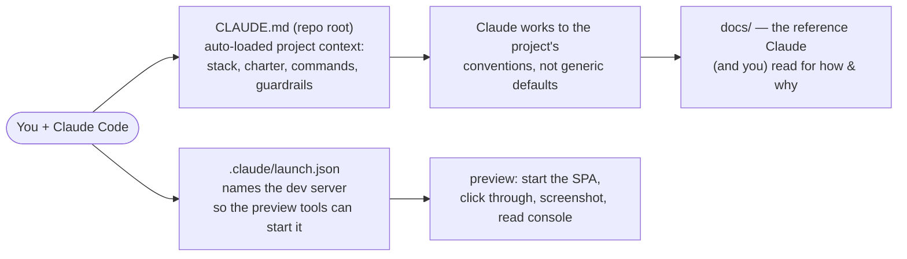

# Working with Claude Code

This repo is set up so [Claude Code](https://claude.com/claude-code) (Anthropic's CLI /
IDE assistant) can develop and maintain it effectively — useful for onboarding and for
keeping the project healthy if the original author moves on. None of this is required to
build or run the app; it is a maintainer aid.

Two committed files do the wiring:

## The two files

### `CLAUDE.md` (repo root)

Claude Code reads this automatically at the start of every session. It is the short
version of the project — the stack, where things live, the **boring-code charter**
(explicit, low-abstraction, hand-written T-SQL, no premature abstraction), the dev/test
commands, and the **guardrails** (the frozen REST contract, intentional snake_case, the
app-applies-schema-on-boot model, production fail-fast secrets, parked CI). Keeping it
accurate is what makes the assistant immediately useful instead of guessing. Treat it like
any other code: update it when a convention changes.

### `.claude/launch.json`

Names the dev server so Claude's **preview** tools can start it and verify changes in a
real browser. Today it has one entry — `client` — which runs `npm --prefix client run dev`
on port **3000** (the Vue dev server, which proxies `/api` to the API). With it, Claude can
start the SPA, click through flows, take screenshots, and read the browser console without
you doing it by hand. (The API and SQL Server are started separately — see
[SETUP.md](SETUP.md).)

## What you can do with Claude here

| Task | What it looks like |
|------|--------------------|
| **Run & verify a UI change** | Claude edits a component, starts the `client` dev server (launch.json), reloads, screenshots, and reads the console — then shows you proof rather than asking you to check. |
| **Run the quality loop** | Ask it to run the pre-push checks: `npm run lint / format:check / test / build` in `client/`, and `dotnet test` from the repo root (it knows the test DB must be up). |
| **Code review / audits** | Point it at a diff or a concern (security, accessibility, performance) and have it review against the codebase and the charter. |
| **Dependency upgrades** | "Update dependencies, majors one at a time, verify each against the tests/build, revert any that can't go green." |
| **Documentation upkeep** | Keep `docs/` accurate and consistent after code changes — it already knows the doc map and which doc owns what. |
| **Understand the system** | "How does X work?" — it reads the relevant code + [ARCHITECTURE.md](ARCHITECTURE.md) and explains, with file references. |

## Tips for good results

- **Lean on the docs.** Ask Claude to read the relevant doc first (`SETUP` to run it,
  `API-GUIDE` for the contract, `ARCHITECTURE` for how/why,
  `ARCHITECTURE-CONSIDERATIONS` for what's a deliberate trade-off vs. a bug).
- **Respect the charter.** This codebase is intentionally low-abstraction; if a change
  starts adding layers or patterns, that's usually the wrong direction here.
- **Ask it to verify before declaring done.** The standard here is "ran the quality loop,
  it's green" — not "should work."
- **The REST contract is frozen.** Renaming a field or changing a status code breaks
  integration partners and the SPA; flag such a need explicitly rather than letting it
  happen as a refactor.
