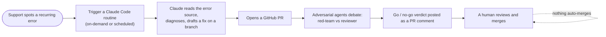

# Design — Role-based docs + Support operations runbook + Observability/remediation plan

**Date:** 2026-06-30
**Status:** Approved (design); spec under review
**Author:** maintainer + Claude

## Problem

The docs are thorough but written for a single reader — a developer/maintainer. Four
teams need to self-serve at different depths, and one of them (Support) currently has
**no operational entry point and no window into what the running app is doing**:

| Team | Needs |
|------|-------|
| **EApps / Data** | Integration API guide; enough backend + security understanding to interact with it |
| **Web / Frontend** | How the app works; the frozen `/api` contract; how to run the client |
| **Infrastructure** | How to deploy it (containers or Windows+IIS) and the security posture |
| **Support** | Daily triage: see what's going wrong and resolve or escalate **without a direct report to the dev team** |

Today the app logs to console/stdout only (noted in ARCHITECTURE-CONSIDERATIONS), so
Support has nowhere to look yet.

## Scope

In scope (this effort = **documentation + a documented plan**, not new infrastructure):

1. A **role "Start here" router** at the top of `docs/` — four thin cards routing each
   team into the existing docs at the right depth.
2. A new **`docs/OPERATIONS.md`** support runbook (the core deliverable).
3. A **"Logging & observability roadmap"** section *inside* OPERATIONS — options menu +
   interim plan, no tool chosen.
4. A documented **Claude-assisted remediation model** — how Support triggers a Claude
   Code routine that opens a *human-reviewable* PR with adversarial-agent verdicts.
5. **Doc-map updates** (CLAUDE.md, ARCHITECTURE docs map) + extend WORKING-WITH-CLAUDE.

## Non-goals (explicit)

- **Not** standing up log aggregation, Sentry/GlitchTip/App Insights/Seq/Loki, or any
  external monitoring this round. We document the options and the plan only.
- **Not** building/wiring the Claude triage→PR routine this round (CI is parked, the repo
  isn't pushed). We document the model + prerequisites; a runnable `/triage` routine is a
  deferred follow-up.
- **Not** changing application code. (The "structured JSON logging" step is documented as
  the recommended first enabling step *when* observability work begins — not done now.)
- **Not** restructuring the existing docs; the role layer is additive (low blast radius).

## Architecture / deliverables

### 1. Role "Start here" router

Lives at the top of the docs index (`docs/README.md` if present, else a new
`## Start here by role` block linked from CLAUDE.md's docs map). Each card =
**what you care about → ordered reading path (links into existing docs) → first 15 minutes**.
Thin routers only — links + intent, never duplicated prose, so they don't rot.

Routing matrix:

| Team | Primary | Then | Run-it |
|------|---------|------|--------|
| EApps / Data | API-GUIDE | ARCHITECTURE "How the App Works" + Authentication/Integration + Data Model | SETUP (integration key) |
| Web / Frontend | ARCHITECTURE "How the App Works" | frontend↔backend section + frozen `/api` contract | SETUP (run the client) |
| Infrastructure | DEPLOYMENT | ARCHITECTURE deployment topology + Health Probes + secrets/config | SETUP (local stack) |
| Support | **OPERATIONS** (new) | Health endpoints + WORKING-WITH-CLAUDE | SETUP (read-only orientation) |

**Skill-level calibration:** each role card opens with one plain-language sentence
("what this app is to you") before the links, so a non-developer isn't dropped straight
into architecture.

### 2. `docs/OPERATIONS.md` — the support runbook

Sections, top-level and self-contained:

1. **Is it up?** — `/api/health/live` (process) vs `/api/health/ready` (DB-backed); what a
   red state on each means; the single first action for each.
2. **Where to look (today).** Honest current state:
   - **Logs:** container stdout (`docker logs <svc>`) *and* Windows/IIS logs — both shown,
     since hosting is undecided.
   - **Audit history** (admin UI / `audit_log`): answers *"did this action happen / who
     changed what"* — a triage aid, **not** an error/exception log. Caveat: it lives in the
     DB, so it's unavailable exactly when the app/DB is down.
3. **Symptom → likely cause → action** table. Conservative actions only (check / restart /
   escalate), each derived from a currently-documented failure mode, e.g.:
   - App won't start → weak/missing secret fail-fast → check config, escalate.
   - `/ready` 503 → DB unreachable → check SQL Server / network, restart order.
   - SSO login fails → Entra misconfig / clock → check claim config, escalate.
   - Outbound API check fails → SSRF rejection / target down → check URL/target, expected.
   - Bursts of 429 → rate limit → confirm traffic source, escalate if legitimate.
4. **Escalation.** A structured report template (what to capture: time, symptom, health
   state, relevant log lines, recent changes) + when it goes to EApps/dev.
5. **Claude-assisted remediation** (see §4 below).

### 3. Logging & observability roadmap (section inside OPERATIONS)

The *plan*, not an implementation. Three layers framed clearly:

- **Health** (up/down) — already exists (`/health/*`).
- **Logs** (what happened) — the gap. Interim: aggregate container/server logs onto a
  **separate box** (so logs survive an app-host outage). Recommended first enabling step
  when work starts: switch the app to **structured JSON console logging** so any sink can
  ingest it.
- **Audit** (who did what in-app) — already exists; triage aid only.

**Options menu (no pick — decide later):**

| Option | Best when |
|--------|-----------|
| Sentry / GlitchTip (self-host, Sentry-compatible) | You want error-grouping/alerting and like the Sentry model |
| Azure Application Insights / Monitor | You lean into the Azure/Entra stack; hosted, searchable, alerting |
| Seq | Smallest self-hosted .NET-native structured-log viewer |
| Grafana Loki | Infra already runs Grafana |
| Existing CSUB logging software | If institutional tooling already exists — prefer reusing it |

**Decision checklist:** separate box · survives app outage · structured JSON · searchable ·
alerting · who hosts/owns it.

### 4. Claude-assisted remediation model (documented, not wired)

The intended Support "fix it" path, with a clear **"not wired up yet — prerequisites
below"** banner:

Guardrails (stated in the doc): a human always merges; the adversarial verdict is
**advisory**, never a self-approving merge gate; fixes land as normal reviewable PRs.

**Prerequisites** (why it's deferred): a reachable **error source** (depends on the
logging roadmap above), a GitHub repo that receives PRs, and a human reviewer/merger.

### 5. Doc-map updates

- CLAUDE.md "Docs map" + ARCHITECTURE docs map gain the role router + OPERATIONS.
- WORKING-WITH-CLAUDE gains a short pointer to the remediation model.
- ARCHITECTURE-CONSIDERATIONS "Logging is console only" trade-off points to the
  OPERATIONS observability roadmap.

## Error handling / edge cases

- Hosting undecided → every log/health instruction gives **both** container and Windows/IIS forms.
- App/DB down → runbook states audit history is unavailable then; health `/live` and host
  logs are the fallback signals.
- Remediation loop with no error source yet → doc sequences "log visibility first."

## Testing / validation strategy (docs)

- All mermaid diagrams render (fence balance, no reserved node ids) — same check used on
  prior doc work.
- All internal links/anchors resolve.
- Factual accuracy: every runbook symptom/action traces to a real, currently-documented
  behavior (no invented endpoints, flags, or commands).
- Role routing links point at sections that exist.

## Rollout

Additive docs; no code or behavior change. Commit with the existing convention; **do not
push** until the user says so. Sequencing: docs land now; observability tooling and the
`/triage` routine are separate future efforts gated on the user's go-ahead.

## Failure modes (from the adversarial check)

| Failure mode | Severity | Disposition |
|---|---|---|
| "Where are the logs" reads as a finished capability | Minor | Marked as documented gap; aggregation is a non-goal now |
| Remediation model looks ready-to-run but plumbing absent | Was critical → resolved | "Not wired up yet" banner + explicit prerequisites |
| Audit history mistaken for an error log | Minor | Reframed as who-did-what triage aid, with down-time caveat |
| Role pages duplicate content and rot | Minor | Thin link-routers only |
| Runbook gives stale/unsafe advice | Minor | Conservative actions only, traced to documented failure modes |
